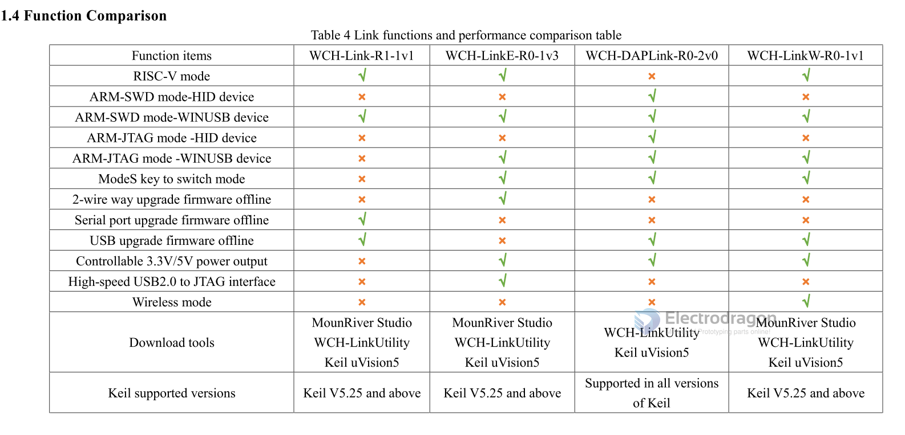
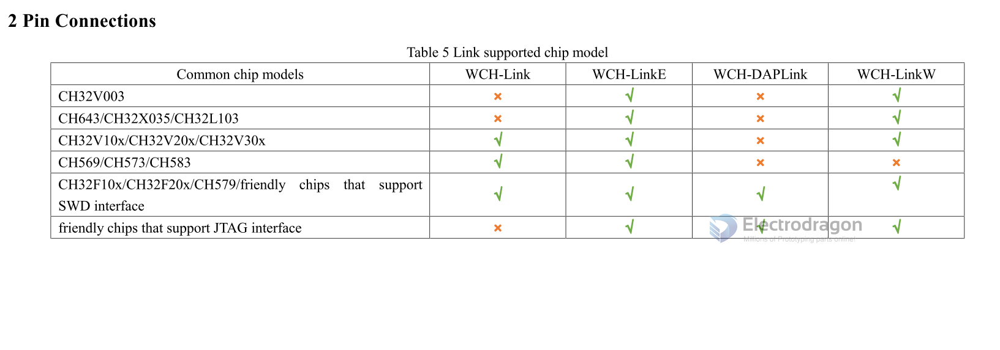
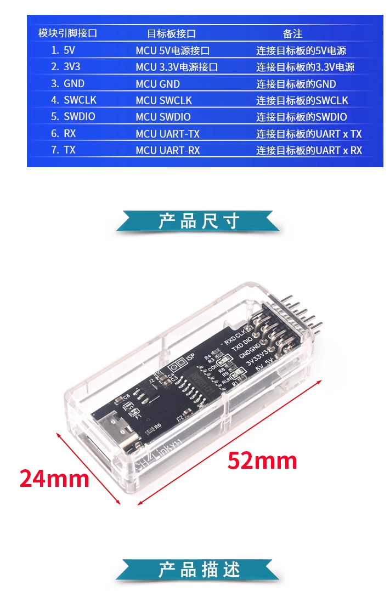

# wchlink-dat

## Note 

Keils 识别不到的需要更新 Keil 版本至 5.25 以上

- [CN userManual](https://www.wch.cn/downloads/WCH-LinkUserManual_PDF.html)
- [EN userManual](https://www.wch-ic.com/downloads/WCH-LinkUserManual_PDF.html)

## Mode

| 模式   | 指示灯         | IDE              | 支持芯片                               |
| ------ | -------------- | ---------------- | -------------------------------------- |
| RISC-V | 空闲时蓝灯常灭 | MounRiver Studio | 本公司支持两线调试接口的 RISC-V 核芯片 |
| ARM    | 空闲时蓝灯常亮 | Keil             | 支持 SWD 协议的 ARM 核芯片             |

### Mode switching

- When Tx is connected to GND, plug the WCH-Link into the USB interface to switch the mode and keep it in this mode the next time it is plugged into the USB interface.
- Example: 
- When the current WCH-Link is idle, the blue light is always off, indicating that it is in RISC-V mode; after powering off, short-circuit Tx and GND and plug it into the USB interface, and the mode is switched to ARM. At this time, the blue light is always on when idle; Turn on Tx and GND, and it will still be in ARM mode the next time you plug in the USB interface.

## Mode [[CMSIS-DAP-dat]]

- 1，确保 WCHlink 工作在 ARM 模式，CON 指示灯亮是 ARM 模式，否则通过短路 TXD-GND 来切换。
- 2，接下来使用和普通 MSIS-DAP（DAPLink）使用完全一样，在 keil 设置中尤其注意 Reset 设置为 SYSRESETREQ。

- [[CMSIS-dap-dat]]

## Boards 

- NOT supported board - [[CH32V003-dat]]

## Functions and Supported Chips 

## reprogram demo video 

- https://www.youtube.com/watch?v=v3h-EoI-HIQ

## Info 

## Software 

- IDE - [[mounriver-dat]]