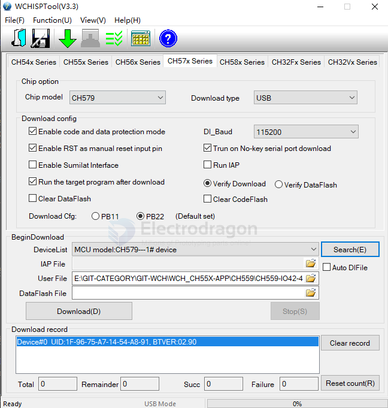
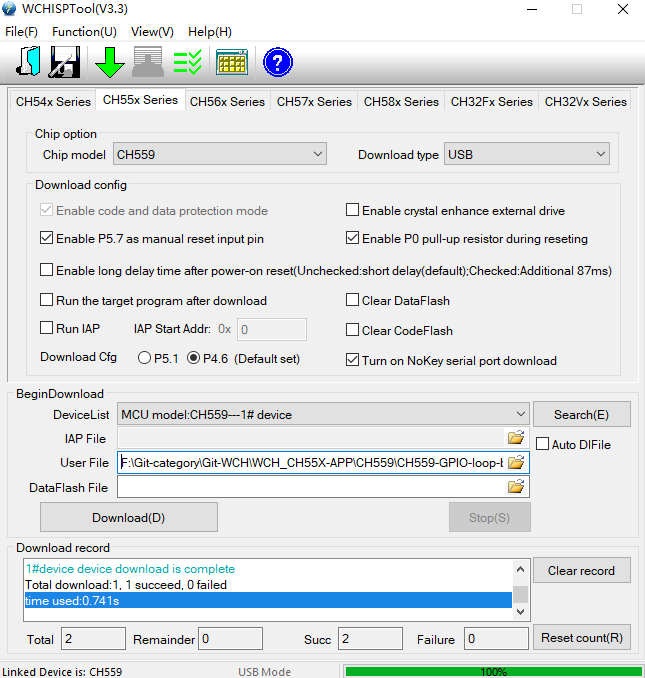
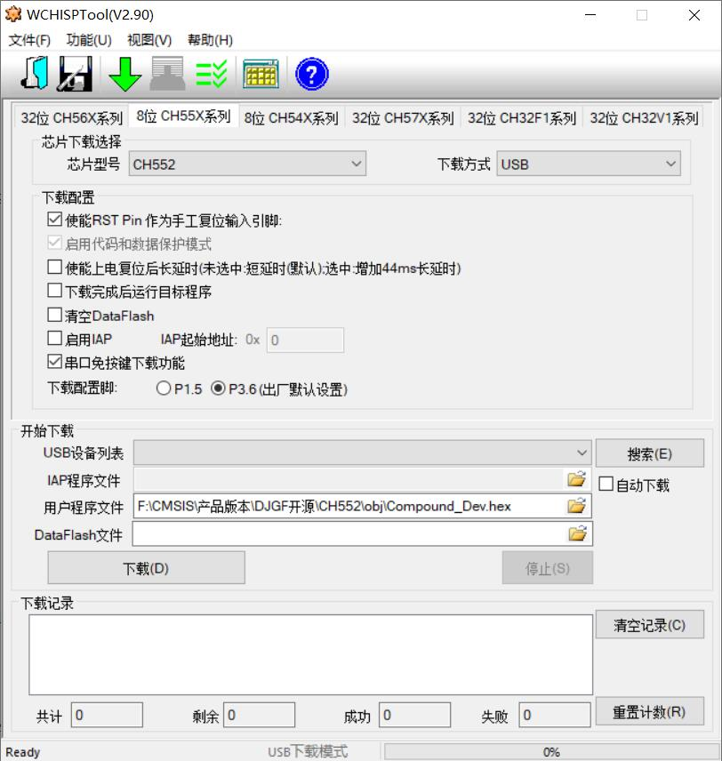
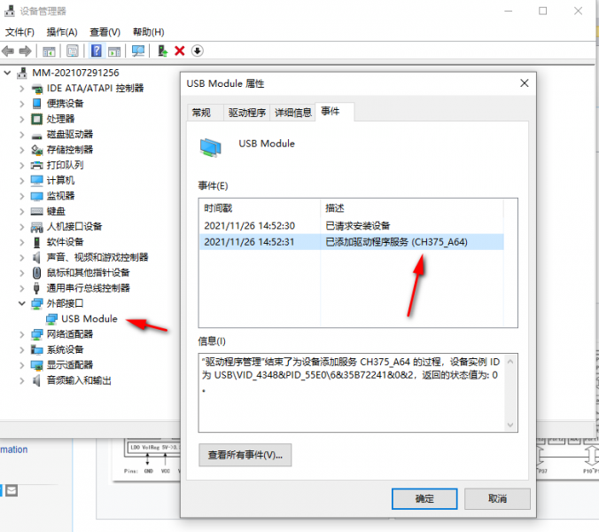
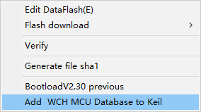

# WCHISPTool 

- via USB port 
- http://www.wch-ic.com/downloads/WCHISPTool_Setup_exe.html

- version 3.4 
- CH54X,CH55X,CH56X,CH57X,CH58X
- CH32F10X,CH32F20X
- CH32V00X,CH32V10X,CH32V20X,CH32V30X

## For CH579

- [[ARM1003-dat]]

## CH559

## CH552

## USB module detect 
* Find "external Interface" -> USB Module in device manager, not COM port serial interface

## add to keil from WCHISPTool 

