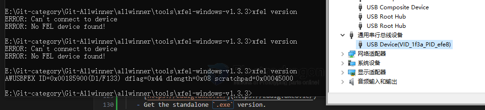

# xfel-dat

- [[ubuntu-dat]] - [[c-errors-dat]]

- [[libusb-dat]] - [[serial-dat]]

Usually comes with the xboot tools:

    git clone https://github.com/xboot/xfel.git
    cd xfel
    make
    make clean && make


- [[C-dat]]

[discussion CN ](https://whycan.com/t_6546.html)

https://github.com/xboot/xfel

## release 

wget https://github.com/xboot/xfel/releases/download/v1.3.3/xfel-windows-v1.3.3.7z


## for F133-A 

xfel version 


## 🧩 XFEL Entry Procedure for F133-A / D1s

1. **Power off the board**
   - Disconnect power or USB.

2. **Press and hold the FEL button**
   - This button is usually marked "FEL" or "BOOT" on the board.
   - If not labeled, refer to the schematic: it connects to **GPIO PL4**.

3. **Power on the board while holding FEL**
   - Plug in the USB cable or apply power.
   - Keep holding the button for 2–3 seconds, then release.

4. **Verify FEL mode on your PC**
   - Run:
     ```bash
     lsusb
     ```
   - You should see something like:
     ```
     Bus 001 Device 005: ID 1f3a:efe8 Allwinner Technology sunxi FEL mode
     ```

5. **Optional: Confirm with `xfel`**
   - If `xfel` is installed:
     ```bash
     xfel version
     ```
   - Output should confirm connection:
     ```
     EGON version: 0x0001a00
     ```


## Overview

| Feature                    | `sunxi-fel`                                  | `xfel`                                          |
|---------------------------|----------------------------------------------|------------------------------------------------|
| Origin                    | Part of **sunxi-tools** (by linux-sunxi)     | Part of **xboot** (by xboot developers)        |
| Language                  | C                                            | C (standalone, simplified)                     |
| Compatibility             | Many Allwinner SoCs (A10, A20, H3, A64, etc.)| Primarily designed for **Allwinner D1 / D1s**  |
| Use Case                  | General FEL access, u-boot, RAM boot         | Simplified D1 booting, xboot-specific flashing |
| Device Support            | Broad SoC support (A-series, H-series)       | Mostly tested on D1, D1s (RISC-V)              |
| Features                  | Read/write memory, boot u-boot, script exec  | Load boot package, run xboot, SPI flash, etc.  |
| Dependencies              | Requires `libusb`                            | Self-contained                                 |
| Project Maturity          | Older, well-established                      | Newer, focused on xboot platform               |
| Command Interface         | CLI                                          | CLI                                            |

---

## ✅ When to Use What

| Situation | Recommended Tool |
|----------|------------------|
| Working with legacy Allwinner ARM SoCs (e.g. A10, A20, A64, H3) | `sunxi-fel` |
| Using D1 / D1s (RISC-V) board, especially with xboot or SDKs    | `xfel`      |
| Booting board into RAM for development/recovery                 | Either, but `sunxi-fel` is more general |
| Flashing an XBoot-based firmware to D1s                         | `xfel`      |


### Using `xfel` (D1/D1s with xboot):

```bash
xfel ddr d1s_ddr.bin
xfel write 0x40000000 xboot.bin
xfel exec 0x40000000
```

## No FEL device found

### ❌ `xfel` Windows: "No FEL device found" — Troubleshooting

Even though Windows detects the USB device (`VID_1f3a PID_efe8`), the `xfel` tool shows:

```
ERROR: Can't connect to device
ERROR: No FEL device found!
```

This typically means the **driver is not correctly bound** to allow `xfel.exe` access.

---

#### 🛠️ Fix: Install the Correct WinUSB Driver

You **must install the `WinUSB` driver** for the FEL device using a tool like **Zadig**:

##### ✅ Step-by-step with Zadig:

1. **Download Zadig**:
   - [https://zadig.akeo.ie/](https://zadig.akeo.ie/)
   - Get the standalone `.exe` version.

2. **Launch Zadig** as Administrator.

3. **Find the FEL device**:
   - Menu: `Options` → Check ✅ `List All Devices`
   - In the dropdown, select:  
     ```
     Allwinner USB Device (1f3a:efe8)
     ```

4. **Install `WinUSB` driver**:
   - In the right pane, change the driver to:
     ```
     WinUSB (libusb)
     ```
   - Click `Install Driver` or `Replace Driver`.

5. **Wait for installation to complete.**

6. **Retry `xfel`**:
   ```bash
   xfel version
   ```

   You should now get output like:
   ```
   xfel v1.3.3
   EGON: 00000000
   ```



## ref 

- [[sunxi-tools-dat]]