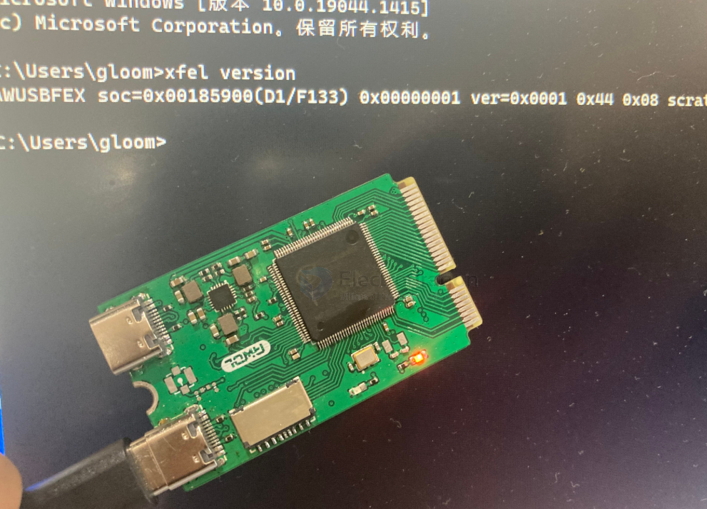

# xfel-dat

- [[ubuntu-dat]]

Usually comes with the xboot tools:

    git clone https://github.com/xboot/xfel.git
    cd xfel
    make

- [[C-dat]]

[discussion CN ](https://whycan.com/t_6546.html)

https://github.com/xboot/xfel


## for F133-A 

xfel version 




## Overview

| Feature                    | `sunxi-fel`                                  | `xfel`                                          |
|---------------------------|----------------------------------------------|------------------------------------------------|
| Origin                    | Part of **sunxi-tools** (by linux-sunxi)     | Part of **xboot** (by xboot developers)        |
| Language                  | C                                            | C (standalone, simplified)                     |
| Compatibility             | Many Allwinner SoCs (A10, A20, H3, A64, etc.)| Primarily designed for **Allwinner D1 / D1s**  |
| Use Case                  | General FEL access, u-boot, RAM boot         | Simplified D1 booting, xboot-specific flashing |
| Device Support            | Broad SoC support (A-series, H-series)       | Mostly tested on D1, D1s (RISC-V)              |
| Features                  | Read/write memory, boot u-boot, script exec  | Load boot package, run xboot, SPI flash, etc.  |
| Dependencies              | Requires `libusb`                            | Self-contained                                 |
| Project Maturity          | Older, well-established                      | Newer, focused on xboot platform               |
| Command Interface         | CLI                                          | CLI                                            |

---

## ✅ When to Use What

| Situation | Recommended Tool |
|----------|------------------|
| Working with legacy Allwinner ARM SoCs (e.g. A10, A20, A64, H3) | `sunxi-fel` |
| Using D1 / D1s (RISC-V) board, especially with xboot or SDKs    | `xfel`      |
| Booting board into RAM for development/recovery                 | Either, but `sunxi-fel` is more general |
| Flashing an XBoot-based firmware to D1s                         | `xfel`      |


### Using `xfel` (D1/D1s with xboot):

```bash
xfel ddr d1s_ddr.bin
xfel write 0x40000000 xboot.bin
xfel exec 0x40000000
```

## ref 

- [[sunxi-tools-dat]]