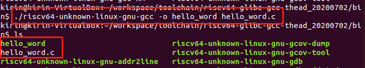

# allwinner-SDK-dat.md

- [[allwinner-dat]]

- [[xboot-dat]] - [[xfel-dat]] - [[uboot-dat]]

- [[TINA-dat]] 

- [[bootloader-dat]]

- [[F1C200S-SDK-dat]] - [[F133-SDK-dat]]

## compile

## Compiler

Download the Hello World file

After compilation, you need to download the compiled hello_word file to the development board for execution.

There are various methods to transfer files; choose the one that suits you best. Common methods include:

- ADB tool - [[adb-dat]]
- NFS mounted file system
- Using an SD card

We recommend using our ADB tool for file transfer. It requires no extra connections, just a single USB cable.

## Flash Tools

- SD card flash == https://www.balena.io/etcher/

1. **PhoenixSuit**: A Windows-based flashing tool, the most commonly used. Connect the PC and development board via a data cable to flash firmware onto the board. Supports partition flashing, suitable for development and small-scale production. Developers are advised to use this tool for firmware upgrades.
2. **LiveSuit**: An Ubuntu-based flashing tool. Connect the PC and development board via a data cable to flash firmware onto the board. It is the Ubuntu version of PhoenixSuit, suitable for Ubuntu developers.
3. PhoenixUSBpro: A Windows-based flashing tool. Connect the PC and development board via a data cable to flash firmware onto the board. One PC can connect up to 8 devices simultaneously for batch flashing, suitable for mass production.

## Flash

- Hardware: 2 x Type-C cables  
- Software: Allwinner flashing tool: [AllwinnertechPhoeniSuit](https://gitlab.com/dongshanpi/tools/-/raw/main/AllwinnertechPhoeniSuit.zip)  
- Software: SPI Nor system image: [tina_d1s-nezha_nor_uart0_nor](https://gitlab.com/dongshanpi/tools/-/raw/main/tina_d1s-nezha_nor_uart0_nor.zip)  
- Software: Allwinner USB flashing driver: [AllwinnerUSBFlashDeviceDriver](https://gitlab.com/dongshanpi/tools/-/raw/main/AllwinnerUSBFlashDeviceDriver.zip)

## repo 

- images and tools - https://github.com/Edragon/allwinner-tools

- https://github.com/Edragon/allwinner == [[T113-dat]]
- https://github.com/Edragon/Allwinner-V831
- https://github.com/Edragon/allwinner-nano

- https://bitbucket.org/e_dragon/allwinner-f1c200s-hdk
- https://bitbucket.org/e_dragon/allwinner-f1c200s-sdk
- https://bitbucket.org/e_dragon/allwinner-h2

- ~~https://bitbucket.org/e_dragon/allwinner-v3s-sdk~~ == https://gitlab.com/hechaogm/allwinner-v3s-sdk/-/tree/master?ref_type=heads

- https://github.com/lindenis-org

- https://gitlab.com/dongshanpi/tools
- https://gitlab.com/users/dongshanpi/projects

## D1-S Flash 

- [[virtualbox-dat]] - [[SDK-dat]] - [[TINA-dat]]

### 操作步骤

1. 将所有文件拷贝到 Ubuntu系统的 ~ 目录下

2. 执行如下解压缩命令，等待解压缩 完成

>   cat tina-d1-h.tar.bz2.* | tar -jxv
> 
1. 解压缩完成后 继续参考 http://riscv64.dongshanpi.com/ 页面 Tina-SDK-V2.0相关资料

### 所有文件MD5校验值

> Ubuntu下输入 md5sum tina-d1-h.tar.bz2.* 查看

e755bae00cd76afc3fb276b4e3fd86ba  tina-d1-h.tar.bz2.00
cb60ecfdb51c624ff3cbd7b24552866f  tina-d1-h.tar.bz2.01
54e56a4cf1cef46ca0a94b85ea1d33a1  tina-d1-h.tar.bz2.02
4988fa08827c0f7af2dc170145e24b26  tina-d1-h.tar.bz2.03
a0463bcf8e73db27b5ecafaac593a919  tina-d1-h.tar.bz2.04
a87382ca16a8c12b3a94f1cad99ce77e  tina-d1-h.tar.bz2.05
5973530baa3b282108351818641c27fd  tina-d1-h.tar.bz2.06
ccd63e1d16534b364a101d2d44416261  tina-d1-h.tar.bz2.07
e0d72713565f4424ea43c07e15a38139  tina-d1-h.tar.bz2.08

### system image and SDK 

- contact and find in our google drive 

### Flash

Allwinner Official Tools
- Allwinner system TF card flashing tool: PhoenixCardv4.2.7.7z.7z
- Allwinner system OTG flashing tool: AllwinnertechPhoeniSuitRelease20201225.zip.zip
Community version flashing tools
- Complete TF card flashing tool: win32diskimager-1.0.0-install.exe
- TF card formatting tool: SDCardFormatterv5_WinEN.zip

### Flashing Allwinner D1 System Image to TF Card (Tutorial)

#### Step 1: Format the TF Card

1. Insert the TF card into a card reader, then connect the reader to your computer's USB port.
2. Use the SD Card Formatter tool to format the TF card. **Backup any important data before formatting.**
3. In the SD Card Formatter interface:
    - Click "Refresh" to detect your TF card.
    - Select your TF card from the list.
    - Click "Format" and confirm by clicking **Yes** in the dialog.
    - Wait for the formatting process to complete.

#### Step 2: Burn the System Image

1. After formatting, open the **PhoenixCard.exe** tool.
2. In PhoenixCard:
    - Find and select your TF card drive letter.
    - Click the "Firmware" button (red box 1) and choose the extracted `tina_d1s-nezha_sd_uart0.img` image file.
    - Click "Startup Card" (red box 2).
    - Click "Burn" (red box 3) and wait for the burning process to finish.

## ref 

- [[allwinner-dat]] - [[TINA-dat]] - [[SDK-dat]]

- [[allwinner-SDK]] - [[allwinner]] - [[SDK]]