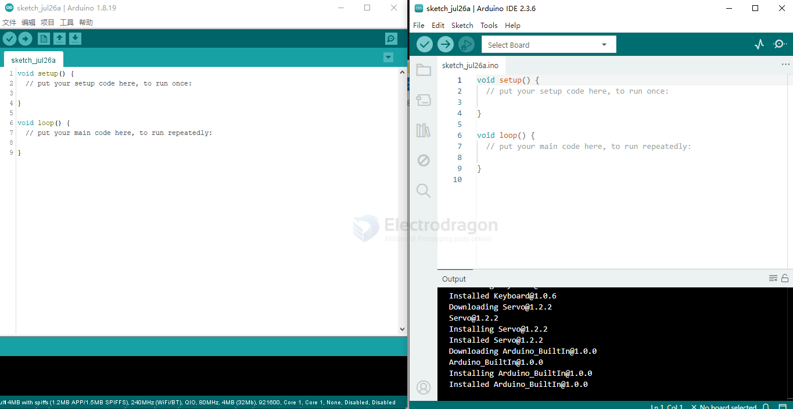
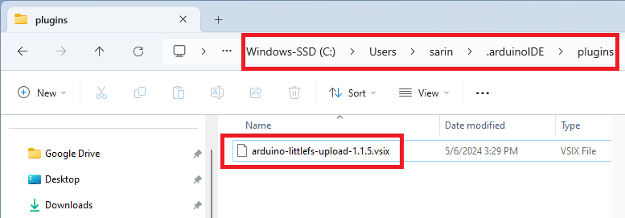

## arduino-ide-dat

- [[arduino-boards-dat]] - [[arduino-app-dat]]

- [[arduino-lib-dat]]

https://github.com/arduino/arduino-ide

## Library list 

multi-task 

SchedTask -2
https://github.com/Nospampls/SchedTask
TaskScheduler - 744
https://github.com/arkhipenko/TaskScheduler

- [[softwareserial-dat]]

- [[arduino-lib]]

## ESP32

- https://raw.githubusercontent.com/espressif/arduino-esp32/gh-pages/package_esp32_index.json

## ESP8266

- https://arduino.esp8266.com/stable/package_esp8266com_index.json

## tips 

### include 

use include “test.h” to add variables

### snippet

    // Periodically blink the onboard LED while listening for serial commands
    if ((int)(millis()/500) > lastPeriod)
    {
        lastPeriod++;
        pinMode(LED, OUTPUT);
        digitalWrite(LED, lastPeriod%2);
    }

### common folder 

windows

ETH.h 
- C:\Users\Administrator\AppData\Local\Arduino15\packages\esp32\hardware\esp32\2.0.6\libraries\Ethernet\src\eth.h
- C:\Users\Administrator\AppData\Local\Arduino15\packages\esp32\hardware\esp32\2.0.6\libraries\Ethernet\src\eth.cpp

## arduino15 

You can open it by pressing Win + R, typing: %LOCALAPPDATA%\Arduino15

Cut the Arduino15 folder.

Paste it somewhere on D drive, for example: D:\Arduino15

Open Command Prompt as Administrator and run: mklink /D "%LOCALAPPDATA%\Arduino15" "D:\Arduino15"

## export compiled binary 

    cmd /C copy C:\Users\ADMINI~1\AppData\Local\Temp\arduino_build_572672\rf-motor.ino_attiny13a_4800000L.lst E:\Git-category\Git-Arduino\arduino-main2\Sketchbook\attiny-app\rf-motor 
            1 file(s) copied.

    rf-motor.ino.with_bootloader_attiny13a_4800000L.hex
    rf-motor.ino_attiny13a_4800000L.hex
    rf-motor.ino_attiny13a_4800000L.lst

- [[avrdude-dat]]

## arduino IDE 2.x 

compare to arduino version 1.x

### LittleFS

LittleFS is a lightweight filesystem created for microcontrollers that lets you access the flash memory as you do in a standard file system on your computer, but it’s simpler and more limited. You can read, write, close, and delete files. Using LittleFS with the ESP32 boards is useful to:

- Create configuration files with settings;
- Save data permanently;
- Create files to save small amounts of data instead of using a microSD card;
- Save HTML, CSS, and JavaScript files to build a web server;
- Save images, figures, and icons;
- And much more.

download from release https://github.com/earlephilhower/arduino-littlefs-upload/releases

On your computer, go to the following path: C:\Users\<username>\.arduinoIDE\. Create a new folder called **plugins** if you haven’t already.

C:\Users\Administrator\.arduinoIDE\plugins\arduino-littlefs-upload-1.5.4.vsix

Move the .vsix file you downloaded previously to the plugins folder (remove any other previous versions of the same plugin if that’s the case).

test code 

    #include "LittleFS.h"
    
    void setup() {
    Serial.begin(115200);
    
    if(!LittleFS.begin()){
        Serial.println("An Error has occurred while mounting LittleFS");
        return;
    }
    
    File file = LittleFS.open("/test_example.txt", "r");
    if(!file){
        Serial.println("Failed to open file for reading");
        return;
    }
    
    Serial.println("File Content:");
    while(file.available()){
        Serial.write(file.read());
    }
    file.close();
    }
    
    void loop() {

    }

## ref 

- [[arduino-code-v1-dat]]
- [[arduino-code-v2-dat]]

our repositories
- https://github.com/Edragon/Arduino-ESP32
- https://github.com/Edragon/Arduino-ESP8266

- [[arduino-ide]]