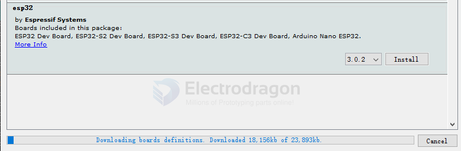
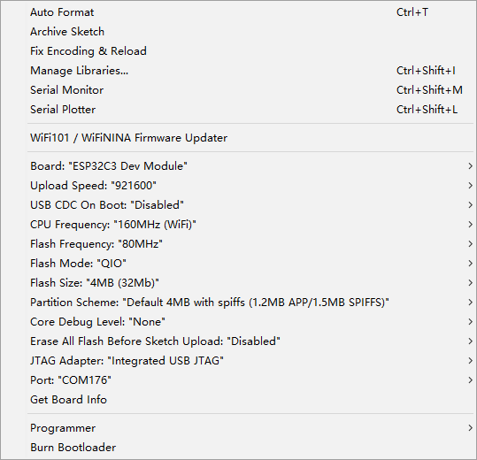

## Guide 

## installation 

https://docs.espressif.com/projects/arduino-esp32/en/latest/getting_started.html#supported-soc-s

- install board json file: https://espressif.github.io/arduino-esp32/package_esp32_index.json

## demo code collection 

- test code - https://github.com/Edragon/Arduino-ESP32
- https://github.com/Edragon/Arduino-ESP32/tree/master/ESP32-ISO

## Wiring 

- [[USB-TTL-dat]]

## Parameters

### ESP32 

### ESP32-C3

esp32 by espressif systems

| Setup                                | Params                  | Note                          |     |
| ------------------------------------ | ----------------------- | ----------------------------- | --- |
| Board                                | ESP32C3 Dev Board       |                               |     |
| Upload Speed                         | 921600                  |                               |     |
| USB CDC on Boot                      | Disabled                |                               |     |
| CPU Frequency                        | 160MHz / 80Mhz          |                               |     |
| Flash Frequency                      | 80MHz / 40Mhz           | ESP flash tool speed to 40MHz |     |
| Flash Mode                           | QIO / DIO               |                               |     |
| Flash Size                           | 4MB                     |                               |     |
| Partition Scheme                     | Default 4MB with spiffs | (1.2MB APP / 1.5MB SPIFFS)    |     |
| Core Debug Level                     | None                    |                               |     |
| Erase All Flash Before Sketch Upload | Enabled                 |                               |     |

some tips:
- flash basic blink sketch into module first to erase all
- 80Mhz + 40Mhz + QIO = OK 
- 80Mhz + 40Mhz + DIO = OK 

## ESP32-S3 

- [[ESP32-S3-dat]], below is a common setup for uploading via type-c

Board: “ESP32S3 Dev Module"
Upload Speed: “921600"
USB Mode: "Hardware CDC and JTAG"
USB CDC On Boot: "Disabled"
USB Firmware MSC On Boot:“Disabled"
USB DFU On Boot: “Disabled"
Upload Mode: "USB-OTG CDC (TinyUSB)
CPU Frequency: "240MHz (WiFi)"
Flash Mode: "QIO 80MHz"
Flash Size: “4MB (32Mb)"
Partition Scheme: “Default 4MB with spiffs (1.2MB APP/1.5MB SPIFFS)"
Core Debug Level: "None"
PSRAM: *Disabled"
Arduino Runs On: “Core 1"
Events Run On: "Core 1"
Erase All Flash Before Sketch Upload: "Disabled"
JTAG Adapter: “Disabled"
Zigbee Mode: "Disabled"
Port: "COM252 (Electrodragon)
Get Board Info

## version 

version 2.0.6 - 2022/2/3
version 2.0.4

## repository
- https://github.com/espressif/arduino-esp32

for [[NWI1126-dat]]: https://github.com/Edragon/Arduino-ESP32/tree/master/BSP/NWI1126

## BSP demo code 

- https://github.com/Edragon/Arduino-ESP32

includes
- bluetooth / wifi tested with official examples

- [[ESP-SDK-dat]]

## Version 

- 2.0.14 

## Common error 

- cc1plus.exe: some warnings being treated as errors

https://forum.arduino.cc/t/esp32-unused-variable-compile-error/1039022/15
C:\Users\Administrator\AppData\Local\Arduino15\packages\esp32\hardware\esp32

    To:
    compiler.warning_flags=-w
    compiler.warning_flags.none=-w
    compiler.warning_flags.default=
    compiler.warning_flags.more=-Wall
    compiler.warning_flags.all=-Wall -Wextra