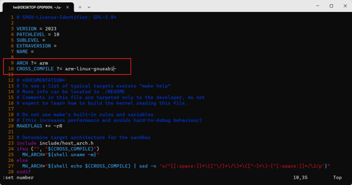

# ARM Cross-Compiler Installation Tutorial

This guide will walk you through installing the ARM cross-compiler toolchain (version 7.2.1 as an example), configuring your environment, and testing the installation.

## 1. Download the Toolchain
You can download version 7.2.1 or choose another version as needed:

    wget http://releases.linaro.org/components/toolchain/binaries/7.2-2017.11/arm-linux-gnueabi/gcc-linaro-7.2.1-2017.11-x86_64_arm-linux-gnueabi.tar.xz

## 2. Extract the Archive

    tar -vxJf gcc-linaro-7.2.1-2017.11-x86_64_arm-linux-gnueabi.tar.xz

## 3. Move the Toolchain to /opt

    sudo cp -r ./gcc-linaro-7.2.1-2017.11-x86_64_arm-linux-gnueabi /opt/

## 4. Add Toolchain to PATH

Edit `/etc/bash.bashrc` and add the following line at the end:

    nano /etc/bash.bashrc
    PATH="$PATH:/opt/gcc-linaro-7.2.1-2017.11-x86_64_arm-linux-gnueabi/bin"

## 5. Reload Environment Variables

    source /etc/bash.bashrc

## 6. Test the Installation
Run the following command to verify the compiler is available:

    arm-linux-gnueabi-gcc -v

If you encounter issues as a regular user, try switching to the root user with `sudo su` and test again.

    Using built-in specs.
    COLLECT_GCC=arm-linux-gnueabi-gcc
    COLLECT_LTO_WRAPPER=/opt/gcc-linaro-7.2.1-2017.11-x86_64_arm-linux-gnueabi/bin/../libexec/gcc/arm-linux-gnueabi/7.2.1/lto-wrapper
    Target: arm-linux-gnueabi
    Configured with: '/home/tcwg-buildslave/workspace/tcwg-make-release/builder_arch/amd64/label/tcwg-x86_64-build/target/arm-linux-gnueabi/snapshots/gcc.git~linaro-7.2-2017.11/configure' SHELL=/bin/bash --with-mpc=/home/tcwg-buildslave/workspace/tcwg-make-release/builder_arch/amd64/label/tcwg-x86_64-build/target/arm-linux-gnueabi/_build/builds/destdir/x86_64-unknown-linux-gnu --with-mpfr=/home/tcwg-buildslave/workspace/tcwg-make-release/builder_arch/amd64/label/tcwg-x86_64-build/target/arm-linux-gnueabi/_build/builds/destdir/x86_64-unknown-linux-gnu --with-gmp=/home/tcwg-buildslave/workspace/tcwg-make-release/builder_arch/amd64/label/tcwg-x86_64-build/target/arm-linux-gnueabi/_build/builds/destdir/x86_64-unknown-linux-gnu --with-gnu-as --with-gnu-ld --disable-libmudflap --enable-lto --enable-shared --without-included-gettext --enable-nls --disable-sjlj-exceptions --enable-gnu-unique-object --enable-linker-build-id --disable-libstdcxx-pch --enable-c99 --enable-clocale=gnu --enable-libstdcxx-debug --enable-long-long --with-cloog=no --with-ppl=no --with-isl=no --disable-multilib --with-float=soft --with-mode=thumb --with-tune=cortex-a9 --with-arch=armv7-a --enable-threads=posix --enable-multiarch --enable-libstdcxx-time=yes --enable-gnu-indirect-function --with-build-sysroot=/home/tcwg-buildslave/workspace/tcwg-make-release/builder_arch/amd64/label/tcwg-x86_64-build/target/arm-linux-gnueabi/_build/sysroots/arm-linux-gnueabi --with-sysroot=/home/tcwg-buildslave/workspace/tcwg-make-release/builder_arch/amd64/label/tcwg-x86_64-build/target/arm-linux-gnueabi/_build/builds/destdir/x86_64-unknown-linux-gnu/arm-linux-gnueabi/libc --enable-checking=release --disable-bootstrap --enable-languages=c,c++,fortran,lto --build=x86_64-unknown-linux-gnu --host=x86_64-unknown-linux-gnu --target=arm-linux-gnueabi --prefix=/home/tcwg-buildslave/workspace/tcwg-make-release/builder_arch/amd64/label/tcwg-x86_64-build/target/arm-linux-gnueabi/_build/builds/destdir/x86_64-unknown-linux-gnu
    Thread model: posix
    gcc version 7.2.1 20171011 (Linaro GCC 7.2-2017.11) 

## setup for uboot 

在上章节中，我们已经配置好了交叉编译器arm-linux-gnueabi，我们只需要修改U-Boot的Makefile，添加以下内容就可以配置好交叉编译环境：

ARCH ?= arm

CROSS_COMPILE ?= arm-linux-gnueabi-

ARCH CROSS_COMPLIE为编译中使用到的架构和编译器，?=指的是如果变量已经被指定则不使用此处提供的变量，修改完的文件可参考下方截图：

图4.x U-Boot编译器的设置

## ref 

- [[ubuntu-dat]]