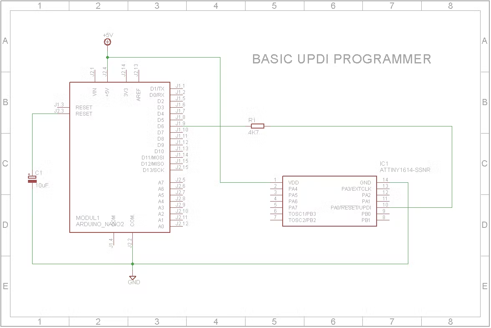
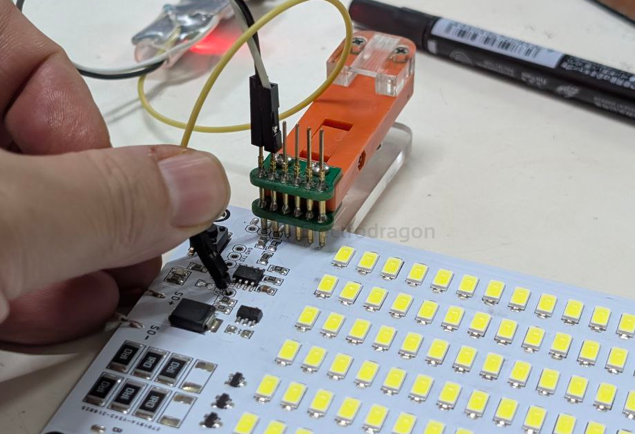
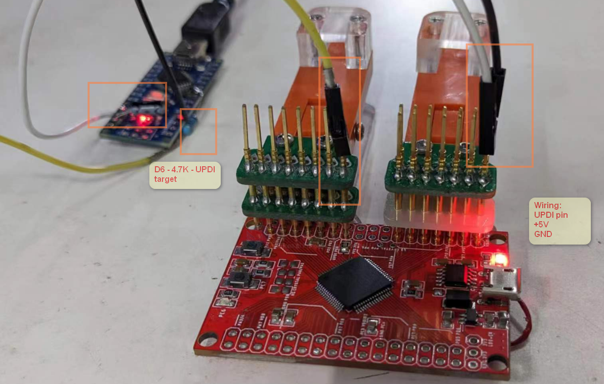
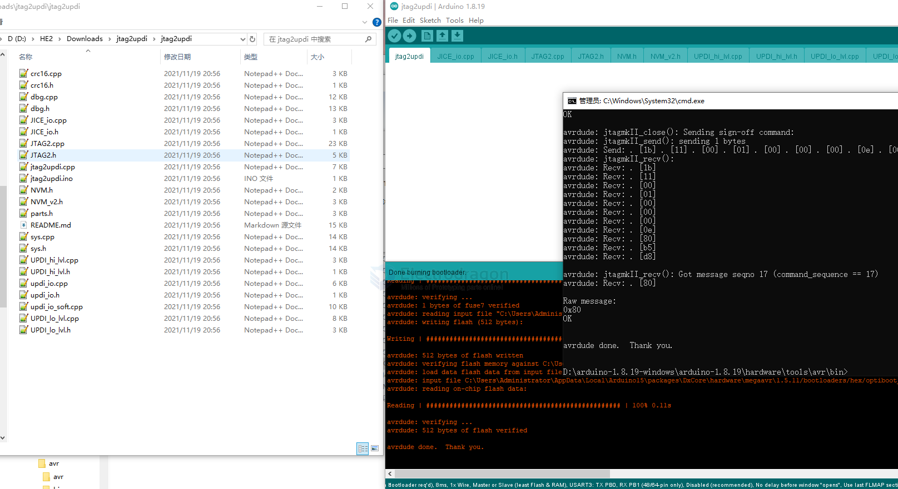
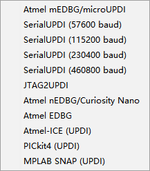

# UPDI-dat

Wiring: 3.3V or 5V, GND, UPDI 

## programmers

## atmel ICE 
- official 

### DIY ATtiny HV UPDI Programmer
https://github.com/Dlloydev/jtag2updi/wiki/DIY-ATtiny-HV-UPDI-Programmer

### Arduino Nano as a programmer 

- [[arduino-nano-dat]]

The 4.7 kOhm resistor connects D6 pin with 6pin header’s top middle pin. 

The 10 uF capacitor connects RST and GND pins.

- https://create.arduino.cc/projecthub/john-bradnam/create-your-own-updi-programmer-1e55f1
- https://www.hackster.io/john-bradnam/create-your-own-updi-programmer-1e55f1

The Programmer needs to be set to jtag2updi (megaTinyCore).

#### firmware 

https://github.com/SpenceKonde/jtag2updi/

original - https://github.com/ElTangas/jtag2updi

## case 2 prgrammering 

- [[ILE1073-dat]] 

## case 1 

Common Errors 

    avrdude: jtagmkII_program_disable(): timeout/error communicating with programmer (status -1)
    ***failed;  
    avrdude: jtagmkII_program_disable(): timeout/error communicating with programmer (status -1)
    ***failed;  
    avrdude: jtagmkII_program_disable(): timeout/error communicating with programmer (status -1)
    ***failed;  
    avrdude: jtagmkII_program_disable(): timeout/error communicating with programmer (status -1)
    ***failed; 

#### Upload firmware to arduino NANO 

## Common Programmer in Arduino 

## Support 

- [[megaCoreX-dat]]

## avrdude command mode 

avrdude -C D:\avrdude.conf -c jtag2updi -P com285 -p avr128db64 -v -v -v -v

avrdude -C D:\avrdude.conf -c jtag2updi -P com285 -p avr128db64 -t -F

## Demo 

- https://t.me/electrodragon3/45

## Boards 

- [[DAR1060-dat]] - [[DAR1064-dat]]

## ref 

- [[atmel-ice-dat]]
  
- [[UPDI]]

