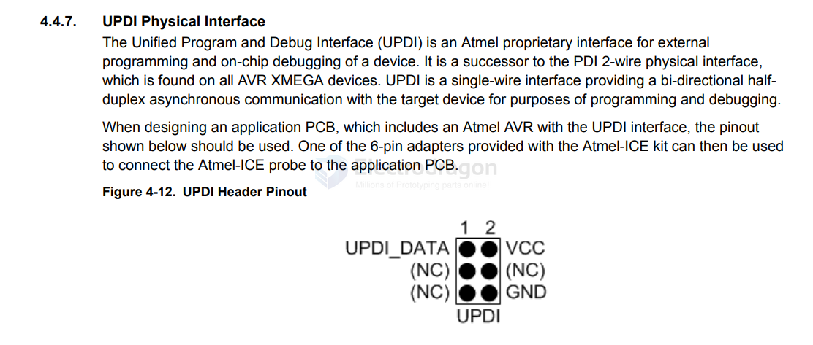
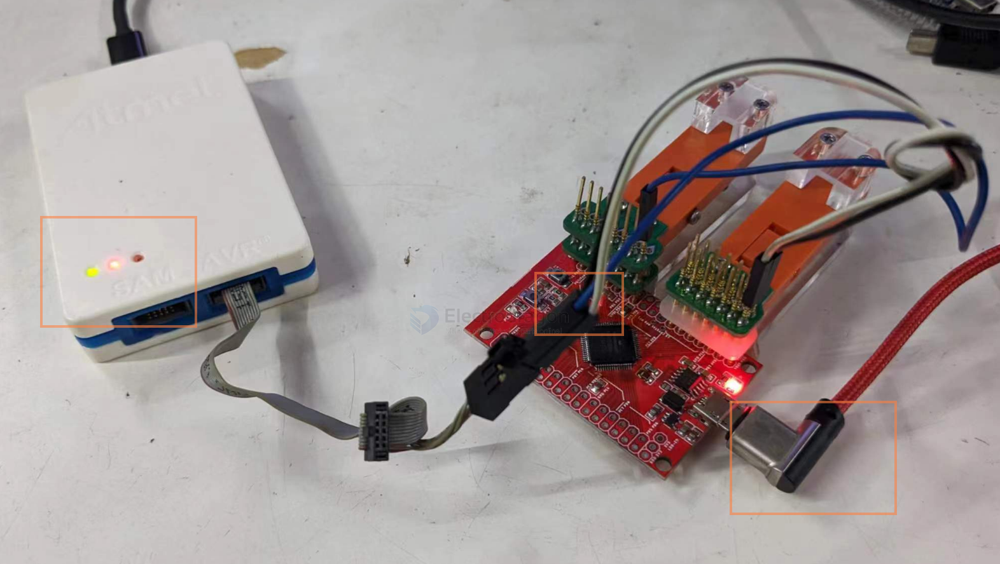

# atmel-ice-dat

- [read the manual PDF here](https://ww1.microchip.com/downloads/aemDocuments/documents/OTH/ProductDocuments/UserGuides/Atmel-ICE_UserGuide.pdf)

## UPDI programming 

UPDI 6 pin port looks like 

| pin   | target board |
| ----- | ------------ |
| blue  | UPDI         |
| white | VCC          |
| black | GND          |

extra power supply from USB 

## ref 

- [[UPDI-dat]] - [[DAR1064-dat]] - [[SDR1096-dat]]