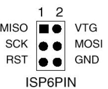

# avr-dat

- [[UPDI-dat]] - [[avrdude-dat]]

- [[arduino-dat]]

## chip 

- [[atmega328-dat]]

### Fuse bit 

Atmega328p UNO 

| fuse set | UNO-1 | UNO-1 note                     | UNO-2 |     | empty |     |
| -------- | ----- | ------------------------------ | ----- | --- | ----- | --- |
| e        | 05    |                                | FD    |     | FF    |     |
| h        | DE    |                                | DE    |     | D9    |     |
| l        | FF    |                                | FF    |     | 62    |     |
| LB       | 0F    | bootloader area NOT visit-able | ?     |     |       |     |

Lock bit

- BLB12 BLB11 - app to bootloader
- BLB02 BLB01 - bootloader to app 
- LB2 LB1 - visit control to  Flash, EEPROM, Fuse (hfuse, lfuse, efuse) and Boot Lock Bit

low fuse 

* bootloader area NOT visit-able - lfuse set to 0x0F
* bootloader area visit-able - lfuse set to 0x3F

## board

- [[arduino-uno-dat]]

## bootloarder 

- [[avrdude-dat]]

## PROG 

- [[DPR1009-dat]] - [[DPR1088-dat]]

converter tools 

- [[DPR1023-dat]] - [[DPR1048-dat]]

legacy wiki page - https://w.electrodragon.com/w/Category:Arduino#Burning_bootloader

## ISP pins 

ICSP 6pins 

