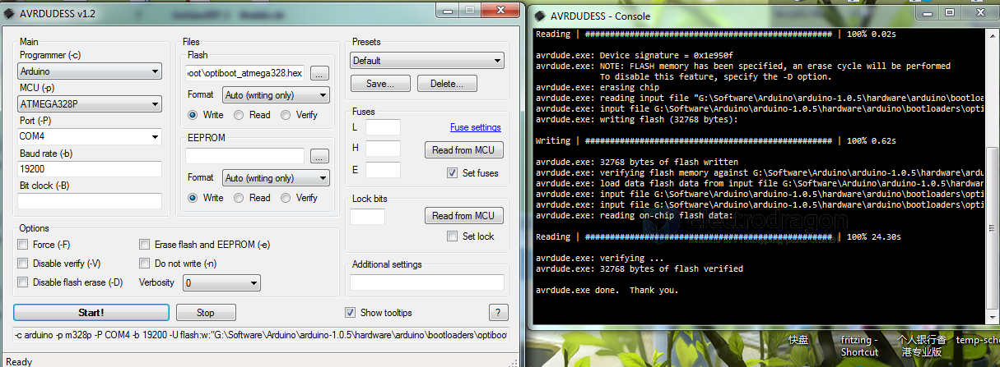
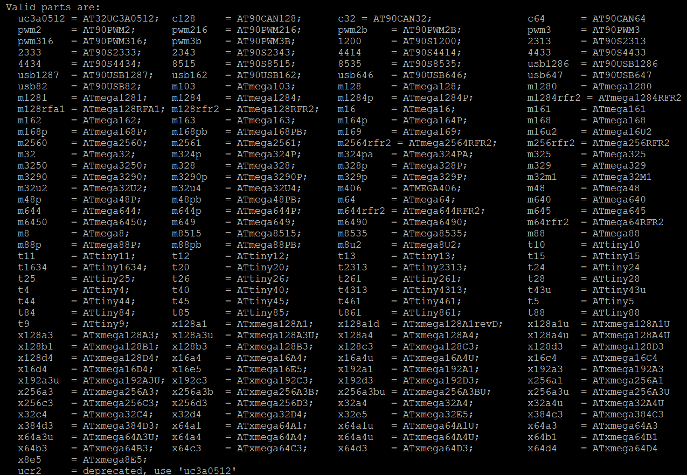

# avrdude-dat

AVR firmware - https://github.com/Edragon/AVR_firmware/tree/master/avrdude

* Program hex file into target IC with [[AVRDUDESS-dat]] or [[AVRDUDE-dat]]

## Version

- avrdudess 

## examples

* Arduino as ISP (UNO) = programmer
* target customized board atmega328p
* ersult efuse FD, high fuse DA, low fuse FF

test: 

    D:\avr-gcc\bin>avrdude -c avrisp -p m328p -P com4 -b 19200
    avrdude: AVR device initialized and ready to accept instructions
    Reading | ################################################## | 100% 0.04s
    avrdude: Device signature = 0x1e950f (probably m328p)
    avrdude: safemode: Fuses OK (E:FD, H:DA, L:FF)
    avrdude done.  Thank you.

## AVRDUDE + Arduino-ISP

find version 

    D:\Git-code\arduino\arduino-1.8.12-windows\arduino-1.8.12\hardware\tools\avr\bin>avrdude -v -CD:\Git-code\arduino\arduino-1.8.12-windows\arduino-1.8.12\hardware\tools\avr\etc\avrdude.conf
    avrdude -v -CD:\Git-code\arduino\arduino-1.8.12-windows\arduino-1.8.12\hardware\tools\avr\etc\avrdude.conf

PROG

    D:\Git-code\arduino\arduino-1.8.12-windows\arduino-1.8.12\hardware\tools\avr\bin>avrdude -CD:\Git-code\arduino\arduino-1.8.12-windows\arduino-1.8.12\hardware\tools\avr\etc\avrdude.conf -c avrisp -p m328p -P com4 -b 19200
    avrdude -CD:\Git-code\arduino\arduino-1.8.12-windows\arduino-1.8.12\hardware\tools\avr\etc\avrdude.conf -c avrisp -p m328p -P com4 -b 19200

CMD1

    avrdude -CD:\Git-code\arduino\arduino-1.8.12-windows\arduino-1.8.12\hardware\tools\avr\etc\avrdude.conf -c avrisp -p m328p -P com4 -b 19200

CMD2

    avrdude -CD:\Git-code\arduino\arduino-1.8.12-windows\arduino-1.8.12\hardware\tools\avr\etc\avrdude.conf -c arduino -p atmega328p -P com4 -b 19200

CMD3

    avrdude -CD:\Git-code\arduino\arduino-1.8.12-windows\arduino-1.8.12\hardware\tools\avr\etc\avrdude.conf -c arduino -p m328p -P com4 -b 19200

    avrdude: AVR device initialized and ready to accept instructions
    Reading | ################################################## | 100% 0.04s
    avrdude: Device signature = 0x1e950f (probably m328p)
    avrdude: safemode: Fuses OK (E:FD, H:DA, L:FF)
    avrdude done.  Thank you.

## AVRDUDE + USBASP, get start within arduino IDE

- [[avrdude-dat]]

avrdude locate 
* D:\arduino-1.8.19-windows\arduino-1.8.19\hardware\tools\avr\bin
* cd D:\Git-code\arduino\arduino-1.8.12-windows\arduino-1.8.12\hardware\tools\avr\bin

conf file locate
* D:\arduino-1.8.19-windows\arduino-1.8.19\hardware\tools\avr\etc

bootloader file locate
* D:\arduino-1.8.19-windows\arduino-1.8.19\hardware\arduino\avr\bootloaders\optiboot\optiboot_atmega328.hex

running with conf file 

    avrdude -C D:\avrdude.conf -c jtag2updi -P com285 -p avr128db64

based on [[cmd-dat]] varilables 

    %ad% -C %conf% -c USBASP -P USB -p atmega328p

### Read Chip using conf file 

    avrdude -CD:\Git-code\arduino\arduino-1.8.12-windows\arduino-1.8.12\hardware\tools\avr\etc\avrdude.conf -c usbasp -p m328p -b 19200

    avrdude: warning: cannot set sck period. please check for usbasp firmware update.
    avrdude: AVR device initialized and ready to accept instructions

    Reading | ################################################## | 100% 0.02s

    avrdude: Device signature = 0x1e9489 (probably m16u2)
    avrdude: Expected signature for ATmega328P is 1E 95 0F
            Double check chip, or use -F to override this check.

    avrdude done.  Thank you.

Correctly Read ATMEGA328P

    Reading | ################################################## | 100% 0.02s

    avrdude: Device signature = 0x1e950f (probably m328p) 

    avrdude: safemode: Fuses OK (E:FD, H:DE, L:FF)

    avrdude done.  Thank you.

### Flash bootloader for Arduino UNO

    avrdude -CD:\Git-code\arduino\arduino-1.8.12-windows\arduino-1.8.12\hardware\tools\avr\etc\avrdude.conf -c usbasp -p m328p -b 19200 -U flash:w:"D:\Git-code\arduino\arduino-1.8.12-windows\arduino-1.8.12\hardware\arduino\avr\bootloaders\optiboot\optiboot_atmega328.hex":a

    set "bl=D:\arduino-1.8.19-windows\arduino-1.8.19\hardware\arduino\avr\bootloaders\optiboot\optiboot_atmega328.hex"

    %ad% -C %conf% -c USBASP -p m328p -b 19200 -U flash:w:"%bl%":a

    %ad% -C %conf% -c USBASP -p m328p -b 19200 -U flash:w:"%bl%":i -U efuse:w:0xFD:m -U hfuse:w:0xDE:m -U lfuse:w:0xFF:m

full commands by arduino IDE, this will be failed if use alone 

    C:\Users\Administrator\AppData\Local\Arduino15\packages\arduino\tools\avrdude\6.3.0-arduino17/bin/avrdude -CC:\Users\Administrator\AppData\Local\Arduino15\packages\arduino\tools\avrdude\6.3.0-arduino17/etc/avrdude.conf -v -patmega328p -cusbasp -Pusb -Uflash:w:D:\arduino-1.8.19-windows\arduino-1.8.19\hardware\arduino\avr/bootloaders/optiboot/optiboot_atmega328.hex:i -Ulock:w:0x0F:m 

    C:\Users\Administrator\AppData\Local\Arduino15\packages\arduino\tools\avrdude\6.3.0-arduino17/bin/avrdude -CC:\Users\Administrator\AppData\Local\Arduino15\packages\arduino\tools\avrdude\6.3.0-arduino17/etc/avrdude.conf -v -patmega328p -cusbasp -Pusb -Uflash:w:D:\arduino-1.8.19-windows\arduino-1.8.19\hardware\arduino\avr/bootloaders/optiboot/optiboot_atmega328.hex:i -Ulock:w:0x0F:m

- [[avrdude-log-dat]]

## Supported List 

- Commands: avrdude -p ?
  

## ref 

- [[avr-dat]]

- [[avrdude]]