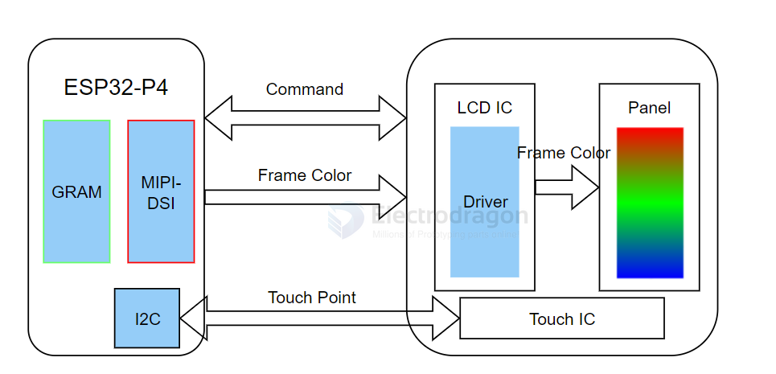
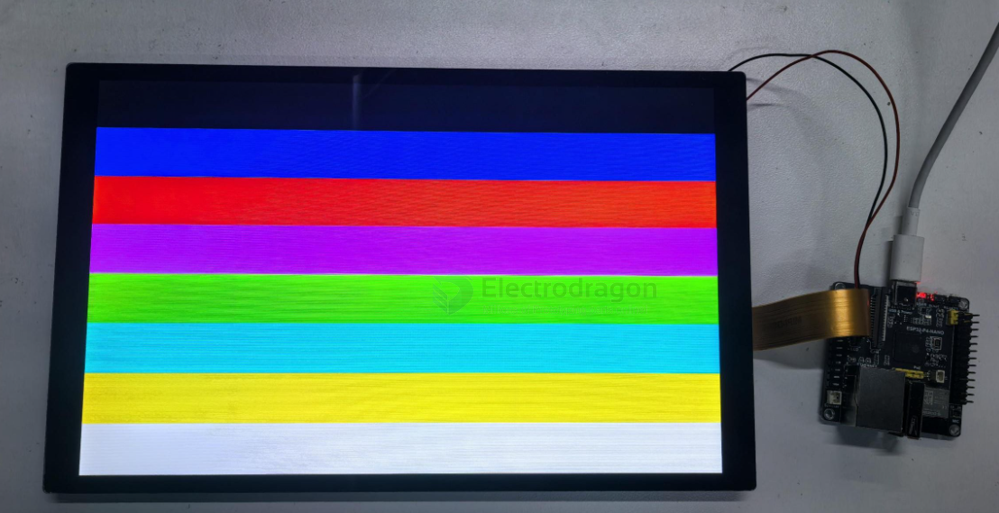

# MIPI-DSI-SDK-dat


## ESP-IDF MIPI-DSI LCD Example

The ESP32-P4  uses the ESP32-P4NRW32 chip, which features:

- Compliance with the MIPI-DSI protocol, using D-PHY v1.1, up to 2 lanes at 1.5Gbps each (total 3Gbps)
- Support for RGB888, RGB565, and YUV422 input formats
- Support for RGB888, RGB666, and RGB565 output formats
- Video mode output for streaming video and fixed image patterns
- MIPI-DSI image processing can also use the 2D-DMA controller, with support for PPA and JPEG codec peripherals

### MIPI-DSI LCD Driver Principle



### Required Hardware

- 10.1-inch display and accessories
- ESP32-P4  (host)

### Steps to Light Up the Display

1. The driver for the 10.1-inch display is packaged as a component and available in the ESP Component Registry.
2. Add the component to your project:

   ```sh
   idf.py add-dependency "waveshare/esp_lcd_jd9365_10_1"
   ```
3. Open your project, select the esp32p4 core, then click the 🔥 (build/flash/monitor) button. When complete, you should see the screen light up and display color bars:




## ref 

- [[display-SDK-dat]]