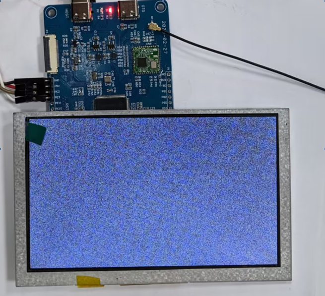

# display-sdk-dat

- [[display-dat]]

- [[interface-SDK-dat]]

## TFT

TFT_eSPI


## OLED


- [[oled-dat]]

run c file oled_1in3

    root@raspberrypi:/home/pi/1.3-OLED-SH106/bcm2835# ./oled_1in3 
    bcm2835 init success  !!! 
    USE_SPI
    **********Init OLED**********
    OLED Show 
    OLED Clear 
    OLED Draw Line 
    OLED Draw Rectangle 
    OLED Draw Rings 
    OLED Display String 
    Showing 


## FPC LCD screen test under linux 

在终端输入如下代码，屏幕会产生雪花屏，这表示屏幕显示是正常的。

    cat /dev/urandom > /dev/fb0
### FPC LCD Screen Test (Linux)

To test if the LCD screen is working, enter the following command in the terminal:

```sh
cat /dev/urandom > /dev/fb0
```

If the screen displays random "snow" (static), it means the display is functioning normally.




## code repo 

- display - https://github.com/Edragon/RPI_Display
- display 2 - https://github.com/Edragon/Display-E-paper


## ref 

- [[SDK-dat]]

- [[RPI-dat]]