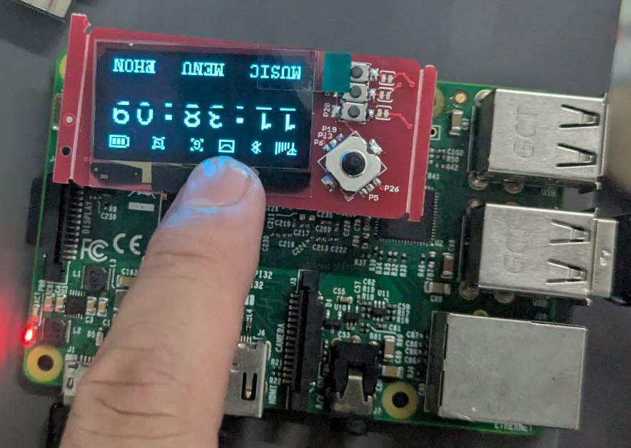

# display-sdk-dat

## TFT

TFT_eSPI

## OLED

- [[oled-dat]]

run c file oled_1in3

    root@raspberrypi:/home/pi/1.3-OLED-SH106/bcm2835# ./oled_1in3 
    bcm2835 init success  !!! 
    USE_SPI
    **********Init OLED**********
    OLED Show 
    OLED Clear 
    OLED Draw Line 
    OLED Draw Rectangle 
    OLED Draw Rings 
    OLED Display String 
    Showing 

## code repo 

- display - https://github.com/Edragon/RPI_Display
- display 2 - https://github.com/Edragon/Display-E-paper

## ref 

- [[SDK-dat]]

- [[RPI-dat]]