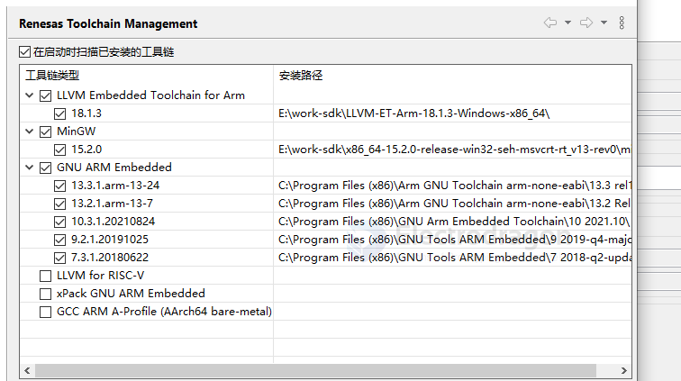

# e2-studio-dat

https://www.renesas.com/en/software-tool/e2-studio?srsltid=AfmBOoqRJ3vAzA1sa5VNA6t3_YMoD8FSVRTE7X5sYAUrm_5UiEulVZfd#downloads

and more [SmartSnippets Studio V2.0.20 for Windows OS](https://www.renesas.com/en/software-tool/smartbond-development-tools#downloads)

## toolchains 

- [] LLVM Embedded Toolchain for Arm
- [] MinGW
- [x] GNU ARM Embedded
- [] LLVM for RISC-V
- [] xPack GNU ARM Embedded
- [] GCC ARM A-Profile (AArch64 bare-metal)

### LLVM Embedded Toolchain for Arm

LLVM-ET-Arm-18.1.3-Windows-x86_64.zip

Copy and paste the URL below into your browser to download the latest release from GitHub:

https://github.com/ARM-software/LLVM-embedded-toolchain-for-Arm/releases/download/release-18.1.3/LLVM-ET-Arm-18.1.3-Windows-x86_64.zip

### MinGW

- [[MinGW-dat]]

- [[DA14585-dat]]