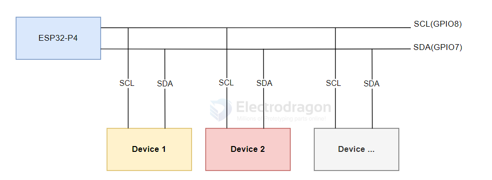
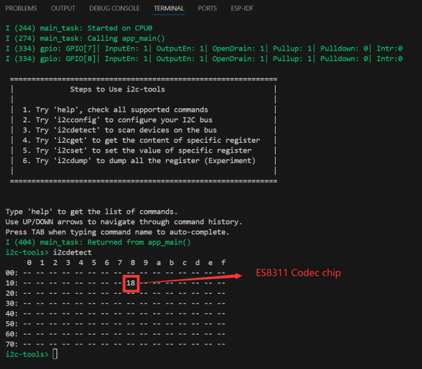

# I2C-SDK-dat

## python 

### I2C scan 

- [[py-rpi-i2c-scan-dat]] - [[LM75-dat]]

output 

    root@raspberrypi:~# python py-rpi-i2c-scan.py 
    ============================================================
    Raspberry Pi I2C Address Scanner
    ============================================================
    I2C Scanner initialized on bus 1
    Scanning I2C bus for devices...
        0  1  2  3  4  5  6  7  8  9  a  b  c  d  e  f
    00:          -- -- -- -- -- -- -- -- -- -- -- -- -- 
    10: -- -- -- -- -- -- -- -- -- -- -- -- -- -- -- -- 
    20: -- -- -- -- -- -- -- -- -- -- -- -- -- -- -- -- 
    30: -- -- -- -- -- -- -- -- -- -- -- -- -- -- -- -- 
    40: -- -- -- -- -- -- -- -- 48 -- -- -- -- -- -- -- 
    50: -- -- -- -- -- -- -- -- -- -- -- -- -- -- -- -- 
    60: -- -- -- -- -- -- -- -- -- -- -- -- -- -- -- -- 
    70: -- -- -- -- -- -- -- --                         

    Found 1 device(s):
    ------------------------------------------------------------
    Address: 0x48 ( 72) - ADS1115/ADS1015 ADC or TMP102 Temperature Sensor

    Scan complete!

    Note: Make sure I2C is enabled in raspi-config
    Install required library: 
    
        pip install smbus2


## ESP-IDF 


### I2C on ESP32-P4

I2C is a commonly used serial communication bus that operates with two wires: one for data (SDA, Serial Data) and one for clock (SCL, Serial Clock). It supports multi-master and multi-slave modes.

On the ESP32-P4, there are two I2C bus interfaces. The chip's internal GPIO matrix allows you to assign any GPIO pin for I2C, giving you flexibility in pin selection. ESP32-P4 supports both Slave and Master modes. In most cases, you will use Master mode to initiate communication, control, and send/receive data to/from slave devices (such as sensors with I2C interfaces).

For ESP32-P4-NANO, the default I2C pins are SCL (GPIO8) and SDA (GPIO7).



#### I2C Configuration in ESP-IDF

In ESP-IDF, you configure the I2C bus using the `i2c_master_bus_config_t` structure:

- `clk_source`: Selects the I2C bus clock source. Use `I2C_CLK_SRC_DEFAULT` for the default clock source (recommended).
- `i2c_port`: Sets which I2C port/controller to use. ESP32-P4 has two ports; use this to select between them if needed.
- `scl_io_num`: Sets the GPIO number for the SCL (clock) line. For ESP32-P4-NANO, use 8.
- `sda_io_num`: Sets the GPIO number for the SDA (data) line. For ESP32-P4-NANO, use 7.
- `glitch_ignore_cnt`: Sets the glitch filter period for the master bus. Glitches shorter than this value are ignored (typically set to 7).
- `enable_internal_pullup`: Enables internal pull-ups. On ESP32-P4-NANO, external pull-ups are already present, so set this to false.

Example configuration:

```c
i2c_master_bus_config_t i2c_bus_config = {
    .clk_source = I2C_CLK_SRC_DEFAULT,
    .i2c_port = I2C_NUM_0,
    .scl_io_num = 8,
    .sda_io_num = 7,
    .glitch_ignore_cnt = 7,
    .flags.enable_internal_pullup = false,
};
```

#### Using i2c_tools and menuconfig

Open the `i2c_tools` project, select the correct COM port and chip model, and click the ⚙️ (settings) icon. This opens the SDK Configuration Editor (menuconfig). Search for "I2C" in the search bar; you will see the SCL and SDA GPIO numbers match the defaults (SCL: GPIO8, SDA: GPIO7).

Next, click the 🔥 (build/flash/monitor) button to compile, flash, and monitor the project. In the terminal, you will see a command menu. When you run `i2cdetect`, it will print all detected I2C addresses. If a device is present, its address will be shown (for example, address 18 is the onboard ES8311 Codec audio chip, which will be explained in the I2S section).



#### Next Steps: Communicating with I2C Devices

You have now completed basic I2C device communication. To use I2C devices, you often need to write register configurations to the device at its I2C address. This requires writing initialization code for each device you want to use. Different I2C devices have different addresses; you can use the `i2ctools` utility to scan for connected devices, then consult the device datasheet for register and configuration details to implement I2C communication in your program.


## ref 

- [[interface-SDK-dat]]