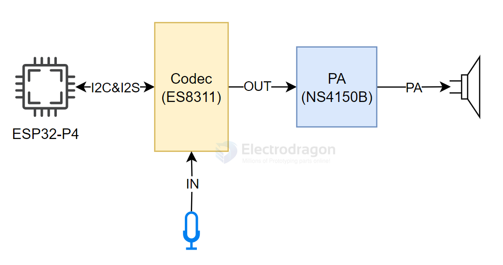
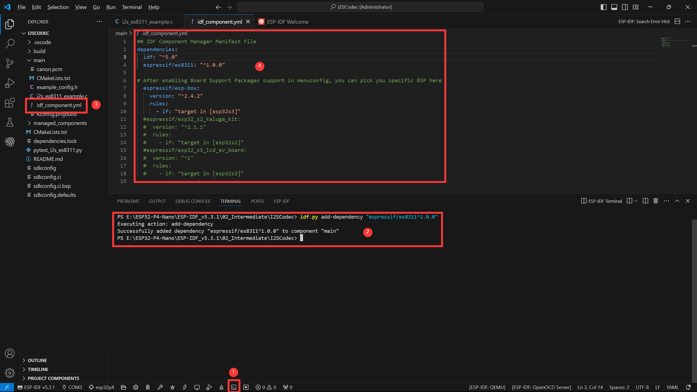
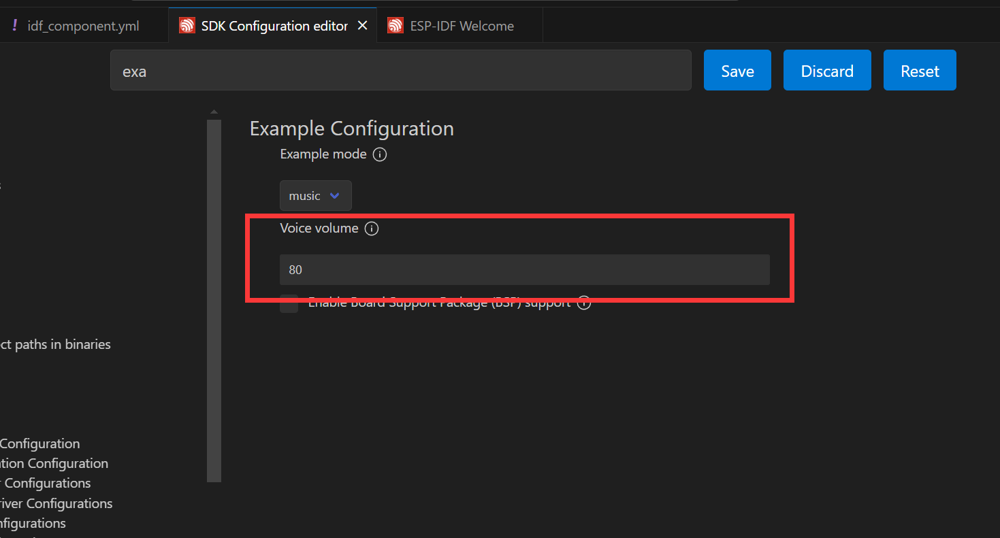
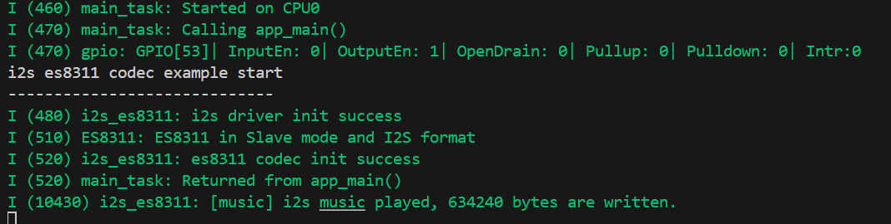
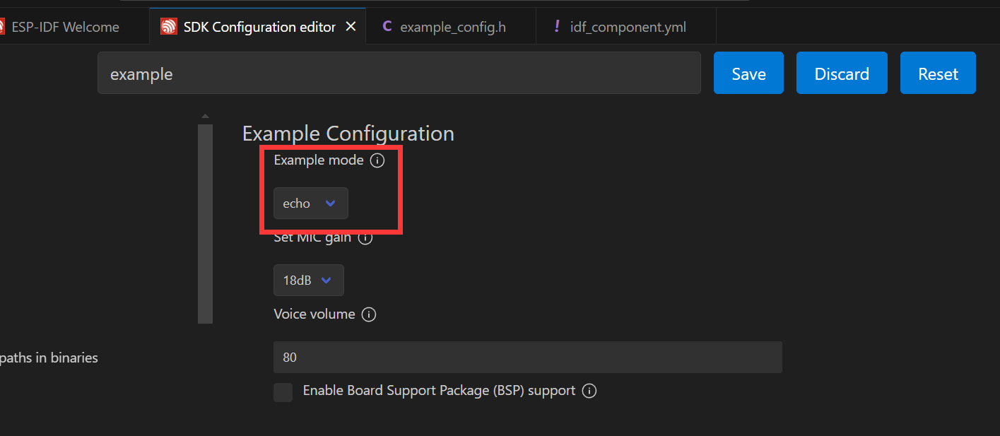

# I2S-SDK-dat

- [[I2S-dat]] - [[es8311-dat]] - [[NS4150-dat]]


## ESP-IDF ES8311 - NS4150 - I2S Audio Example

I2S (Inter-IC Sound) is a digital communication protocol for transmitting audio data. It is a serial bus interface mainly used for digital audio data transfer between devices such as DSPs, DACs, ADCs, and audio codecs.

The ESP32-P4 includes one I2S peripheral. By configuring this peripheral, you can use the I2S driver to input and output sampled audio data. The ESP32-P4 board features an ES8311 codec chip and an NS4150B amplifier chip. The I2S bus and pin mapping are as follows:

- **MCLK (Master Clock)**: Main clock signal, usually provided by an external device (MCU or DSP) to the ES8311 for its internal digital audio processing.
- **SCLK (Serial Clock)**: Serial clock for I2S data transfer, generated by the master device to synchronize data rate. Each bit of audio data requires one clock cycle.
- **ASDOUT (Audio Serial Data Output) / DOUT**: Audio data output pin. ES8311 outputs decoded digital audio data here, which is then sent to the amplifier or other audio devices.
- **LRCK (Left/Right Clock) / WS (Word Select)**: Indicates whether the current data sample is for the left or right channel. In I2S, one clock cycle is for left channel data, the next for right channel data.
- **DSDIN (Digital Serial Data Input) / DIN**: Receives digital audio data from external devices or the master. ES8311 decodes and processes this data internally.



| Function Pin | ESP32-P4 Pin |
|--------------|-------------|
| MCLK         | GPIO13      |
| SCLK         | GPIO12      |
| ASDOUT       | GPIO11      |
| LRCK         | GPIO10      |
| DSDIN        | GPIO9       |
| PA_Ctrl (Amp Enable, High Active) | GPIO53 |

The ES8311 driver for ESP32-P4 uses the ES8311 component, which can be added via the IDF Component Manager:

```sh
idf.py add-dependency "espressif/es8311"
```

Open the `i2scodec` project and add the component as shown below:



Steps:
- Open the ESP-IDF Terminal.
- Add the required component using the command above.
- After successful addition, an `idf_component.yml` file will appear in the `main` folder. This file manages project components.
- You will see the `espressif/es8311` component listed. It will be included during project build.

Next, click the ⚙️ (settings) icon, search for "Example", and adjust the volume as needed.



Connect a speaker, then click the 🔥 (build/flash/monitor) button. When complete, the terminal will show the result—your ESP32-P4 is now playing audio:



If you set echo mode in the settings, audio will be captured by the microphone and output through the speaker:




## ref 

- [[interface-SDK-dat]]