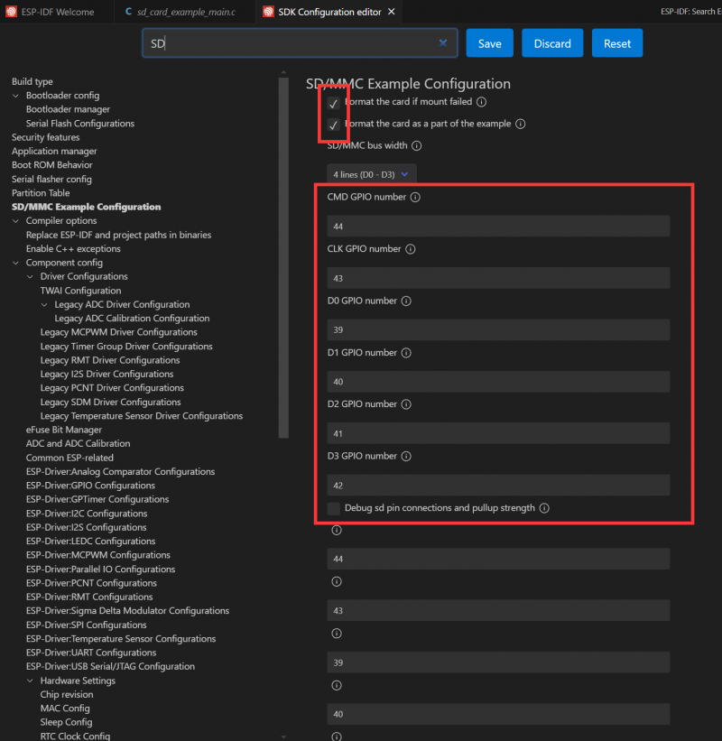
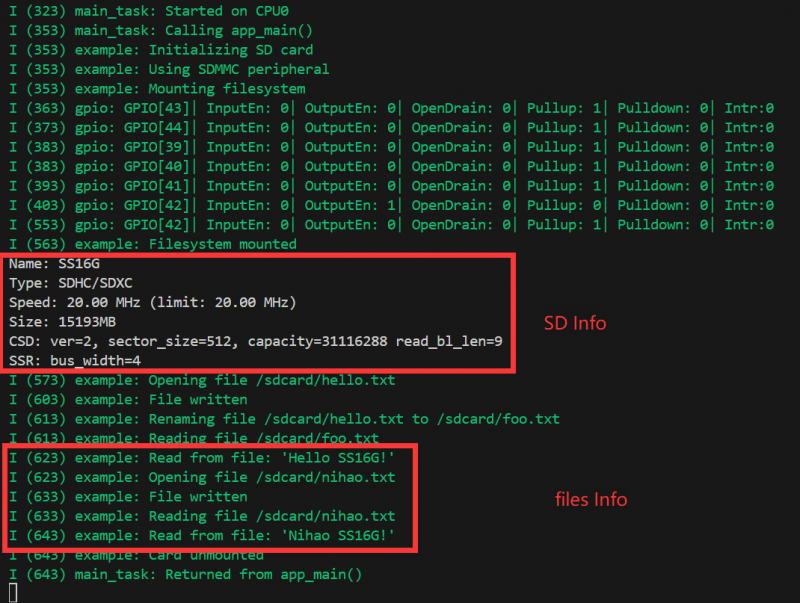

# SD-SDK-dat


## ESP-IDF

### SDMMC Example

The ESP32-P4 board features a 4-wire SDIO 3.0 card slot for external storage expansion.

#### Supported Speed Modes

- Default speed (20 MHz)
- High-speed mode (40 MHz)

#### Configuring Bus Width and Frequency

In ESP-IDF, use `sdmmc_host_t` and `sdmmc_slot_config_t` to set up the SDMMC interface. For default 20 MHz frequency and 4-wire communication:

```c
sdmmc_host_t host = SDMMC_HOST_DEFAULT();
sdmmc_slot_config_t slot_config = SDMMC_SLOT_CONFIG_DEFAULT();
```

To support 40 MHz high-speed communication, adjust the `max_freq_khz` field in the `sdmmc_host_t` structure:

```c
sdmmc_host_t host = SDMMC_HOST_DEFAULT();
host.max_freq_khz = SDMMC_FREQ_HIGHSPEED;
```

For ESP32-P4, the SDMMC 4-wire connection should be defined as:

```c
sdmmc_slot_config_t slot_config = SDMMC_SLOT_CONFIG_DEFAULT();
slot_config.width = 4;
slot_config.clk = 43;
slot_config.cmd = 44;
slot_config.d0 = 39;
slot_config.d1 = 40;
slot_config.d2 = 41;
slot_config.d3 = 42;
slot_config.flags |= SDMMC_SLOT_FLAG_INTERNAL_PULLUP;
```

#### Project Setup and Configuration

Open the `sdmmc` project, select the correct COM port and chip model. The demo project defines pins as macros, so you may need to configure them, or you can enter the pin numbers directly. Click the ⚙️ (settings) icon to open the SDK Configuration Editor (menuconfig). Search for "sd" in the search bar; you will see the configuration options. Enable default initialization and default example file creation:



#### Build, Flash, and Monitor

Insert a prepared SD card, then click the 🔥 (build/flash/monitor) button. After completion, the terminal will display the contents of the SD card directory:



## ref 

- [[interface-SDK-dat]]