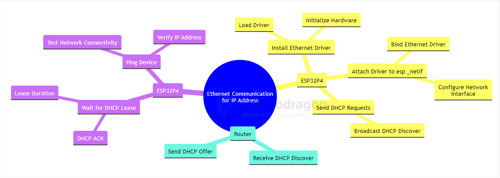
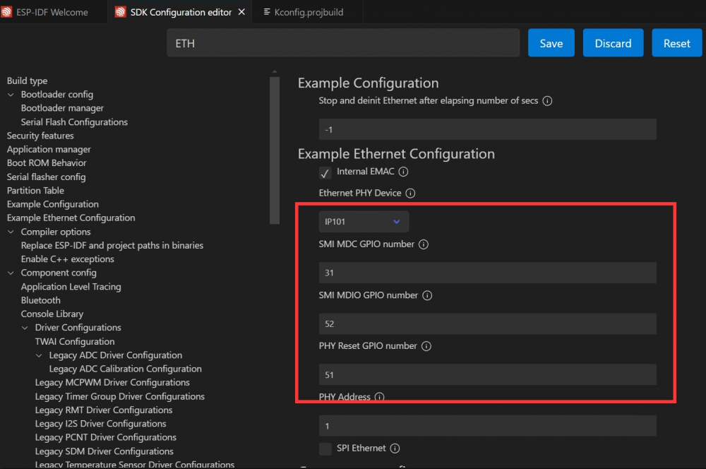
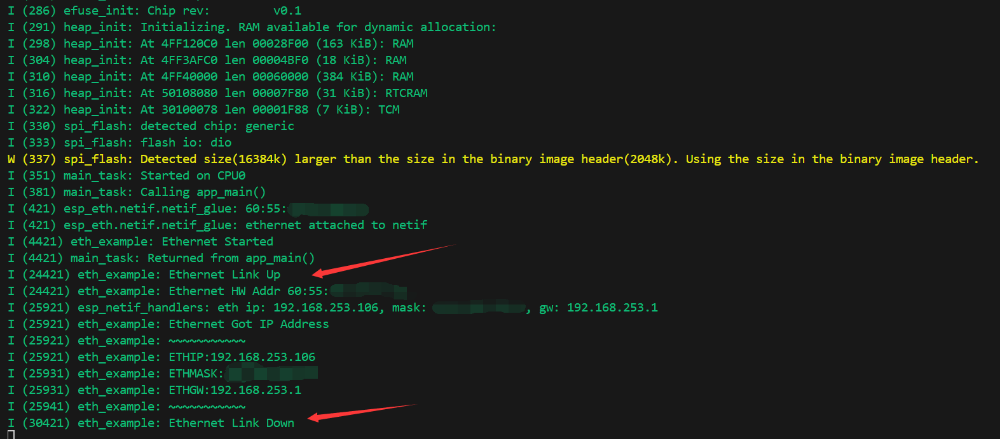
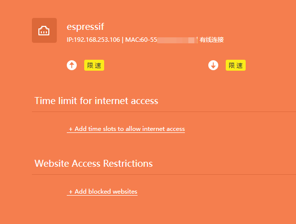

# ethernet-SDK-dat

## ESP-IDF Example: Ethernet Driver

This example demonstrates the basic usage of the Ethernet driver and `esp_netif` in ESP-IDF. The Ethernet driver initialization is separated into a dedicated subcomponent, making it clear how to distinguish between driver and `esp_netif` initialization. The workflow is illustrated below:

### RMII Interface Definition

The ESP32-P4 chip connects to the IP101GRI PHY chip via the RMII interface. The pin definitions are as follows:

- **TXD[1:0]**: Transmit data lines, controlled by GPIO34 and GPIO35
- **RXD[1:0]**: Receive data lines, controlled by GPIO30 and GPIO29
- **TX_EN**: Transmit enable signal, controlled by GPIO49
- **CRS_DV**: Carrier sense and data valid signal, controlled by GPIO28
- **REF_CLK**: Reference clock, controlled by GPIO50 (50MHz generated from a 25MHz external crystal via the PHY)
- **MDIO and MDC**: Management data interface for Ethernet (PHY control/configuration), controlled by GPIO52 and GPIO31
- **RESET**: Resets the IP101GRI PHY, controlled by GPIO51

### Project Setup and Configuration

Open the `ethernetbasic` project, select the correct COM port and chip model, and click the ⚙️ (settings) icon. This opens the SDK Configuration Editor (menuconfig). Search for "ETH" in the search bar; you will see the relevant parameters. Match them to the diagram below:

### Build, Flash, and Monitor

Click the 🔥 (build/flash/monitor) button to compile, flash, and monitor the project. In the terminal, you will see the program start. When you plug in the Ethernet cable, the device will obtain an IP address; unplugging the cable will disconnect the network, as shown:

You can check your router to see a device named "espressif" connected. At this point, your ESP32-P4-NANO is successfully online.

## ref 

- [[interface-SDK-dat]]

- [[ESP-IDF-dat]]