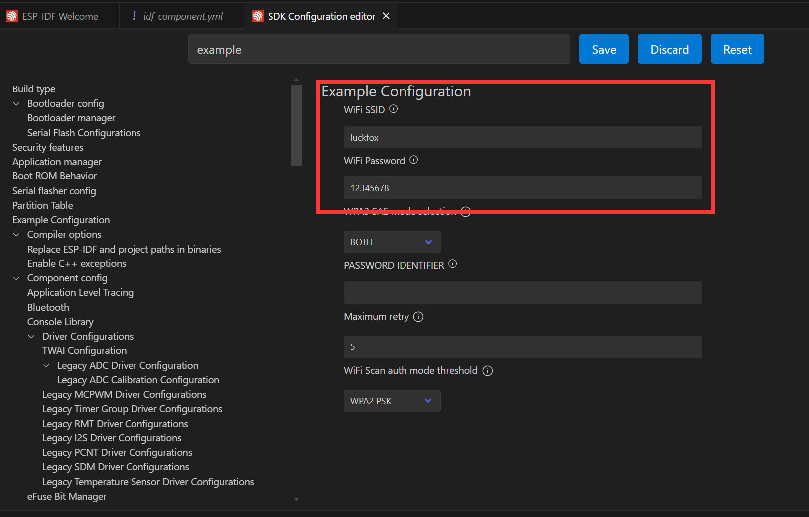

# wifi-sdk-dat

- [[WebSerial-dat]]


## ESP-IDF WiFi Networking Example

The ESP32-P4 does not have built-in WiFi or Bluetooth. Instead, it uses an ESP32-C6 module connected via SDIO to provide WiFi functionality. The ESP32-C6 acts as a slave, supporting WiFi 6 and Bluetooth 5, while the ESP32-P4 acts as the host and communicates via SDIO.

By adding two components, you can seamlessly use `esp_wifi` in your project:

```sh
idf.py add-dependency "espressif/esp_wifi_remote"
idf.py add-dependency "espressif/esp_hosted"
```

Open the `wifistation` project and add the components as shown below:


Steps:
- Open the ESP-IDF Terminal.
- Add the required components using the commands above.
- After successful addition, an `idf_component.yml` file will appear in the `main` folder. This file manages project components.
- You will see `espressif/esp_hosted: "*"` and `espressif/esp_wifi_remote: "*"` listed. These will be included during project build.

Next, click the ⚙️ (settings) icon and search for "Example". Set the WiFi SSID and password. Note: ESP32-C6 supports 2.4GHz WiFi 6 only, so ensure your target WiFi is 2.4GHz. Save your changes before proceeding!



Finally, click the 🔥 (build/flash/monitor) button. When complete, the terminal will show the connection result—your ESP32-P4 is now connected to WiFi:


## ref 

- [[wifi-dat]] - [[interface-SDK-dat]]