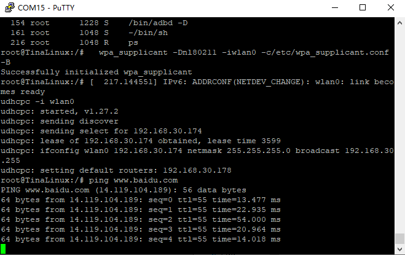

# linux-dat

- [[ubuntu-dat]] - [[arm-compiler-dat]]

- [[linux-mint-dat]]

- [[virtualbox-dat]]


## for F1C100

https://gitee.com/LicheePiNano/Linux.git

完整下载命令为：

    git clone https://gitee.com/LicheePiNano/Linux.git

    git clone --depth=1 -b master https://gitee.com/LicheePiNano/Linux.git

    git clone --depth=1 -b nano-4.14-exp https://github.com/Lichee-Pi/linux.git 


config == 使用./arch/arm/configs/f1c100s_nano_linux_defconfig 配置文件

compile

    make ARCH=arm f1c100s_nano_linux_defconfig

    make ARCH=arm CROSS_COMPILE=arm-linux-gnueabi- -j8

    make ARCH=arm CROSS_COMPILE=arm-linux-gnueabi- -j16 INSTALL_MOD_PATH=out modules

    make ARCH=arm CROSS_COMPILE=arm-linux-gnueabi- -j16 INSTALL_MOD_PATH=out modules_install

...

    AS      arch/arm/boot/compressed/piggy.o
    LD      arch/arm/boot/compressed/vmlinux
    OBJCOPY arch/arm/boot/zImage
    Kernel: arch/arm/boot/zImage is ready

编译成功后，生成文件所在位置：

- 内核img文件：  ./arch/arm/boot/zImage
- 设备树dtb文件: ./arch/arm/boot/dts/suniv-f1c100s-licheepi-nano.dtb
- modules文件夹：./out/lib/modules

将zImage与dtb文件放入nano第一分区．


### note 

修改下载的配置文件名为.config == [[config]]

    mv lichee_nano_linux.config ./config

    make ARCH=arm

系统默认的账号密码

账号：root

密码：licheepi

## setup 

### wifi 

- [[WIFI-DAT]]


#### WiFi Setup (English)

##### 1. Enable the Wireless Network Card

```sh
ifconfig wlan0 up
```

##### 2. Scan for Nearby WiFi Networks

```sh
iw wlan0 scan | grep SSID
```

##### 3. Configure WiFi SSID and Password

Edit and run the following to set your WiFi credentials:

```sh
echo "
update_config=1
network={
    ssid="your_ssid"      # WiFi name
    psk="your_password"   # WiFi password
}" > /etc/wpa_supplicant.conf
```

##### 4. Connect to the Wireless Network

```sh
wpa_supplicant -Dnl80211 -iwlan0 -c/etc/wpa_supplicant.conf -B
```

##### 5. Obtain IP Address via DHCP

```sh
udhcpc -i wlan0
```

##### 6. Test Connection

```sh
ping www.baidu.com
```




## ref 

- [[allwinner-dat]] - [[F1C100-dat]]