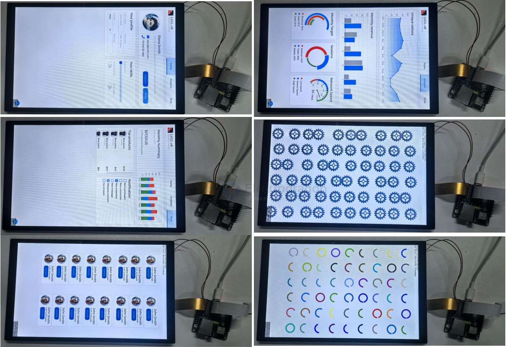

# LVGL-SDK-dat


## ESP-IDF ESP32-P4 LVGL HMI Example

This example demonstrates how the ESP32-P4 displays LVGL graphics via the MIPI DSI interface, showcasing the powerful image processing capabilities of the ESP32-P4.

### Required Hardware
- 10.1-inch display and accessories
- ESP32-P4  (host)

### Steps to Light Up the Display
1. The driver for the 10.1-inch display is packaged as a component and available in the ESP Component Registry.
2. Add the component to your project:
   ```sh
   idf.py add-dependency "waveshare/esp_lcd_jd9365_10_1"
   ```
3. Open your project, select the esp32p4 core, then click the 🔥 (build/flash/monitor) button. When complete, you should see the LVGL screen:




## ref 

- [[interface-SDK-dat]] - [[LVGL-dat]] - [[display-SDK-dat]] 