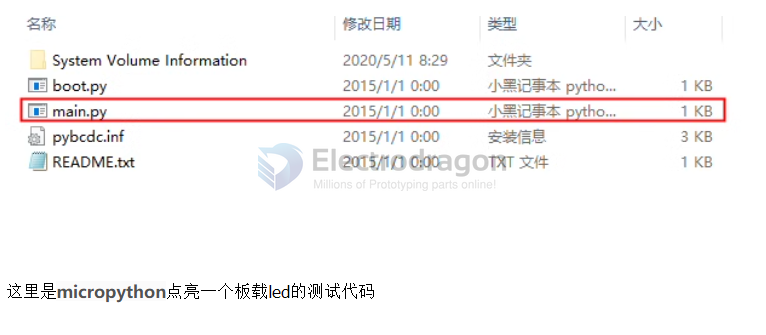
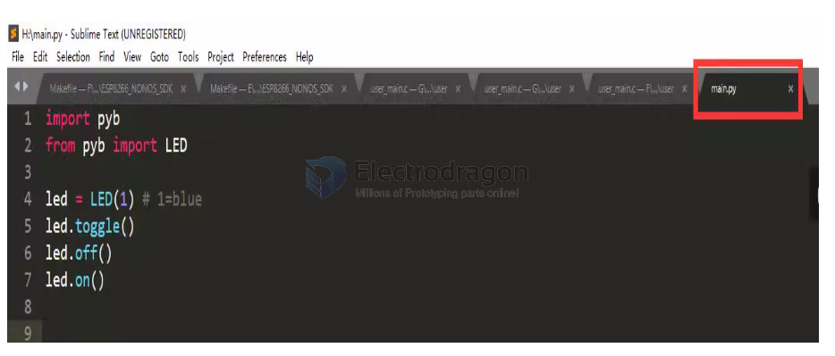

# micropython dat

- [[CircuitPython-dat]]

- [[MP-ESP32-dat]] - [[MP-STM32-dat]]

Feature: Audio Codec, BLE, Battery Charging, CAN, Camera, DAC, Display, Dual-core, Environment Sensor, Ethernet, External Flash, External RAM, Feather, IMU, JST-PH, JST-SH, LoRa, Microphone, PoE, RGB LED, SDCard, Secure Element, USB, USB-C, WiFi, microSD, mikroBUS

MCU: AE722F80F55D5XX, RA6M5, cc3200, esp32, esp32c3, esp32c6, esp32s2, esp32s3, esp8266, mimxrt, nrf51, nrf52, nrf91, ra4m1, ra4w1, ra6m1, ra6m2, ra6m5, rp2040, rp2350, samd21, samd51, stm32f0, stm32f4, stm32f411, stm32f7, stm32g0, stm32g4, stm32h5, stm32h7, stm32l0, stm32l1, stm32l4, stm32wb, stm32wl

## About micropython:

Since the memory of STM32F401 is small, you need to install flash to simulate a USB flash drive. Recommended flash: W25Q32JVSSIQ 32MBit

The memory of STM32F411 is twice as large, so you don’t need an external flash to simulate a USB flash drive

Open the USB flash drive, edit the main.py file, click Save, and reset the MCU to execute the program.

## compatible boards 

- [[ESP32-S3-dat]] - [[NWI1243-dat]]

- [[STM32F401-dat]] - [[DOD1096-dat]]

- [[ESP8266-SDK-dat]]

- [[SAMD21-dat]]

- [[RPI-dat]]

## DEV 

- [[camera-SDK-dat]]

## relevant other useful tools 

- [[ampy-dat]] - [[rshell-dat]] - [[mpremote-dat]]

## flash 

    sudo esptool.py --port /dev/ttyUSB0 erase_flash
    sudo esptool.py --port /dev/ttyUSB0 --baud 460800 write-flash --flash-size=detect 0 ~/Downloads/esp8266

    esptool --port COM6 erase_flash

esp8266
    esptool --port COM6 --baud 460800 write-flash --flash-size=detect 0 ~/Downloads/esp8266

esp32 

    esptool --port COM6 --baud 460800 write-flash 0x1000 ESP32_GENERIC-20250415-v1.25.0.bin

and after flash 

    rst:0x1 (POWERON_RESET),boot:0x13 (SPI_FAST_FLASH_BOOT)
    configsip: 0, SPIWP:0xee
    clk_drv:0x00,q_drv:0x00,d_drv:0x00,cs0_drv:0x00,hd_drv:0x00,wp_drv:0x00
    mode:DIO, clock div:2
    load:0x3fff0030,len:4892
    ho 0 tail 12 room 4
    load:0x40078000,len:14896
    load:0x40080400,len:4
    load:0x40080404,len:3372
    entry 0x400805b0
    Performing initial setup
    MicroPython v1.25.0 on 2025-04-15; Generic ESP32 module with ESP32
    Type "help()" for more information.
    >>> 

## basic operations 

List Files in Current Directory

    import os

    print(os.listdir())

## Typical Boot Flow on ESP32

    Power On / Reset
    ↓
    Run boot.py
    ↓
    Run main.py

- [[boot.py]] - [[main.py]]

## hardware 

- [[I2C-dat]] - [[ESP32-HDK-dat]]

📌 Common ESP32 I2C Pins

| Function | GPIO | Notes |
|----------|------|-------|
| SDA | 21 | Common default SDA pin |
| SCL | 22 | Common default SCL pin |

- [[mp-i2c-1-dat.py]]

- [[mp-ssd1306-1-dat.py]] 

## code library 

https://github.com/micropython-Chinese-Community/mpy-lib

## ref 

- [[script-based-SDK]]

- [[SDK-dat]]

- [[SERIAL-DAT]]