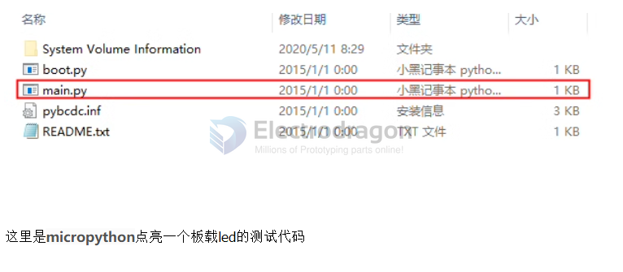
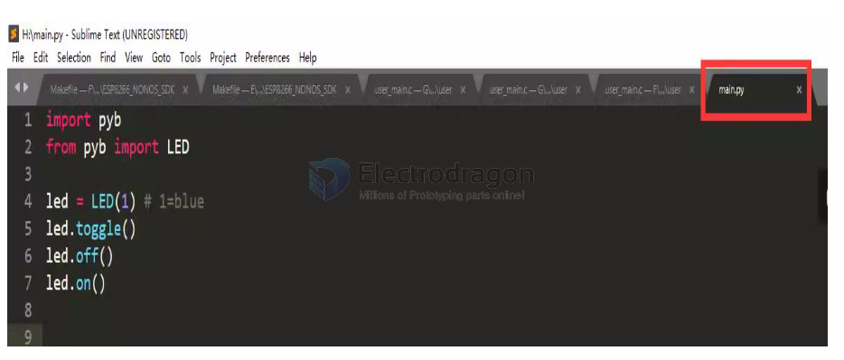

# micropython dat

- https://github.com/Edragon/Code-MicroPython
- https://github.com/Edragon/STM32-F4-MicroPython2
- https://github.com/Edragon/STM32F4_MP-TPY

legacy wiki page - https://w.electrodragon.com/w/Micropython_Guide

## About micropython:

Since the memory of STM32F401 is small, you need to install flash to simulate a USB flash drive. Recommended flash: W25Q32JVSSIQ 32MBit

The memory of STM32F411 is twice as large, so you don’t need an external flash to simulate a USB flash drive

Open the USB flash drive, edit the main.py file, click Save, and reset the MCU to execute the program.

## Micropython Firmware / Bootloader 

For STM32F405RGT

* Upload firmware hex by ST-link, no need reset pin
* Flash Firmware - TPYBoardV102.hex

* Reboot board and connect by USB, it will format itself, two LEDs ON, this takes 3-5 seconds

* after this, U-disk will show up and sequential LED blink.

* Now can upload new sketch into it.

## compatible boards 

- [[STM32F401-dat]]

- [[DOD1096-dat]]
