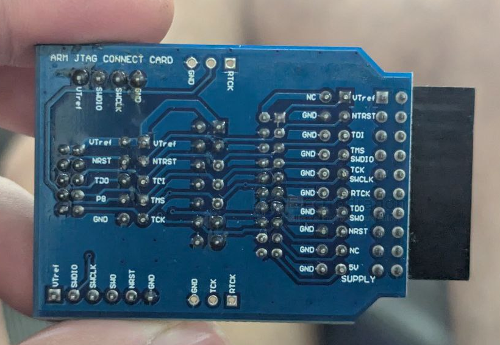
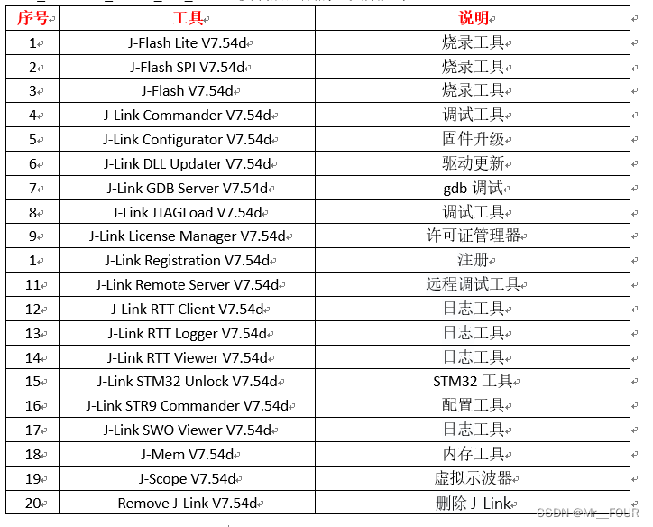
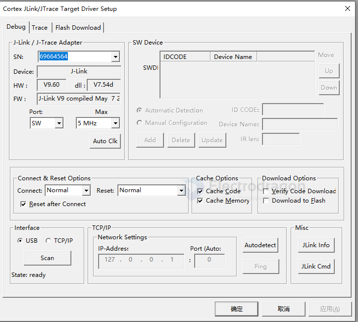
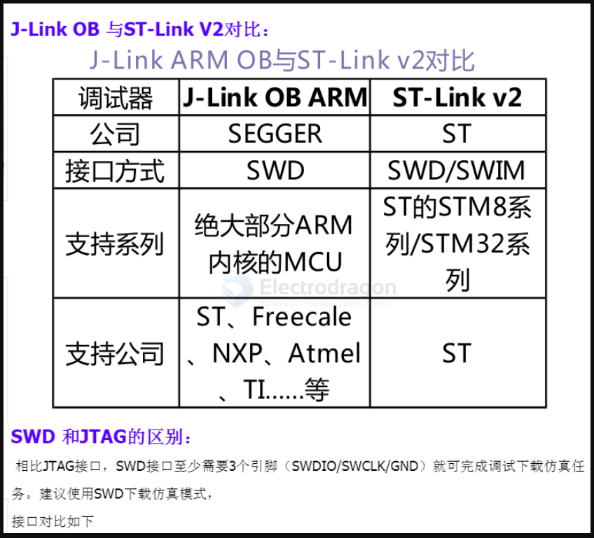
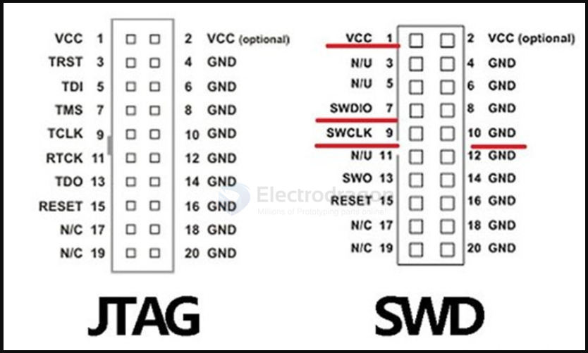
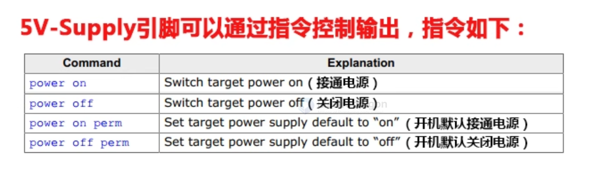
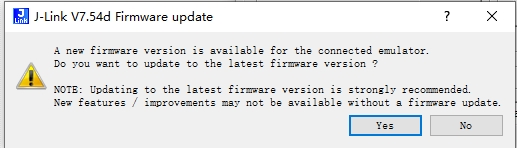

# JLINK dat 

- [[ARM-dat]]

- [[DPR1135-dat]]

JLink is a the SEGGER company launched JTAG emulator for ARM core chip to support simulation. IAR EWARM, ADS, KEIL, WINARM, RealView and other integrated development environment with the support all ARM7/ARM9 kernel chip simulation and seamless connectivity through the RDI interface and the integrated development environment, easy to operate, easy to connect, easy to learn, learning to develop ARM the best and most practical development tools.

path 
- D:\Program Files\SEGGER\JLink\
- C:\Program Files\SEGGER\JLink_V782

## interface 

- [[JTAG-dat]] - [[SWD-dat]]

## driver installation 

https://www.segger.com/downloads/jlink/

https://www.segger.com/downloads/jlink/JLink_Windows_V782_x86_64.exe

2 applications found that can be updated to V7.82 of the J-Link software:
- Ozone - The J-Link Debugger V328e (DLL V7. 86e in *c:\Program Files\SEccER\0zone*)
- Keil MDK-ARM (DLL V7. 54d in *d: (Keil_v5\ARM\Segger*)

- JLink_Windows_V754d_x86_64.exe

after installation, tools are available for: 

## add system path 

JLink.exe == 

   C:\Users\Administrator>JLink.exe
   SEGGER J-Link Commander V7.54d (Compiled Sep 28 2021 16:20:01)
   DLL version V7.54d, compiled Sep 28 2021 16:18:43

   Connecting to J-Link via USB...O.K.
   Firmware: J-Link V9 compiled May  7 2021 16:26:12
   Hardware version: V9.60
   S/N: 69664564
   License(s): RDI, GDB, FlashDL, FlashBP, JFlash
   VTref=3.340V

   Type "connect" to establish a target connection, '?' for help

## config in MDK-ARM

## optional tools 

- [[jflash-dat]]

### 1. J-Flash Lite (Programming Tool)
First, connect the hardware: connect the SWD interface of the J-Link to the MCU's SWD interface (GND, SWCLK, SWDIO, VCC; VCC can be left unconnected).
After installing the J-Link driver or Segger IDE, search for "J-Flash" in the Start menu and open it. If the connection is correct, the device type will usually be automatically recognized.

Click OK to open the interface. After "Erase Chip" is done, browse for the hex or bin file to be programmed, then click "Program Device" and wait for completion.

### 2. J-Flash SPI (Programming Tool)
Use J-Link to program or read SPI Flash memory. The J-Link software includes a tool called JFlashSPI, which is used for programming and reading SPI memory.
It is similar to J-Flash, but uses a different interface.

**Steps:**
1. Connect the SPI Flash chip:
   Click Target -> Connect. If successful, connection information will be displayed at the bottom, including the Flash chip model, manufacturer, Flash ID, etc.
2. Open the program file:
   Click File -> Open data file to open the font library file to be programmed. Multiple file formats are supported. If you select a bin file (which has no start address), you need to manually enter the programming start address—just enter 0.
3. Download:
   Click Target -> Auto to download the program to the Flash chip. After completion, a success message will be shown at the bottom. The programming speed is quite fast; for example, a 170KB font file takes less than 1 second.
4. Reading program files:
   Like reading/writing MCU programs, reading SPI Flash chip programs is also supported.

### 3. J-Flash (Programming Tool)
Can be used to program, read, verify, and erase Flash.
Same as above.
J-Flash can also unlock chips.
**Key step!** If the chip has read protection enabled, direct read/write will fail. For example, when using Keil, the chip model can be read, but programming always fails. Therefore, you must unlock the chip first, which takes about 10 seconds.

### 4. J-Link Commander (Debugging Tool)
J-Link can use commander commands to debug via the debug port and obtain real-time on-site data and debug information. This improves development efficiency, helps obtain on-site code data, and shortens bug locating time.

**How to use J-Link Commander:**
1. Connect J-Link to the device and install the appropriate driver.
2. Open the J-Link Commander terminal.
3. Enter the `connect` command.
4. When prompted, enter `?`.
5. The system will prompt you to select the target platform. For example, for the FR8018, select Cortex M3.
6. Select the SWD interface and set the transfer speed.
7. The interface will display that Cortex M3 has been detected, indicating a successful connection to the target board.
8. Now you can use J-Link Commander commands for debugging.

For commander commands, refer to the official SEGGER documentation:  
https://wiki.segger.com/J-Link_Commander

**Common commands:**
- `halt`: Stop execution. After stopping, the PC pointer, SP address, and other information will be displayed.
- `go`: Run.
- `mem` (mem8, mem16, mem32): Read memory address. Specify start address and length. Can be used with a map file to read variable values.
- `write` (write1, write2, write4): Write to a specified address. Specify start address and length. Can be used with a map file to write variable values.

The `halt` command can be used together with `go`. After executing `halt`, the device stops running and the current register values are displayed in the commander terminal. Pay special attention to the PC pointer, SP pointer, and R14 register values.

## About J-Link 

* J-Link-OB developed by Segger, for development board "on-board"
* Interface include JTAG and SWD, simple version only have SWD
* Support IDE: J-Flash ARM、Keil MDK-ARM、IAR EWARM、CoIDE、mikroC PRO for ARM、nRFgo Studio
* Supported MCUs: ST、Freecale、nuvoton、NXP、TI, Cypress, Atmel, Analog, Fujitsu, Toshiba, Energy Micro and more
* Could be detected as fake in MDK, so not as good as STLINK or DAPLINK

## supported MCUs 

- ARM7/9/11，
- Cortex-A5/A7/A8/A9，
- Cortex-M0/M1/M3/M4/M7，Cortex-R4，
- Microchip PIC32
- Renesas RX100/RX200/RX610/RX621/RX62N/RX62T/RX630/RX631/RX63N

## usage 

- VOUT is a 3.3V voltage output pin.
- Users can remove the internal shorting jumper of the device to disable the 3.3V output.
- VTREF is the internal voltage reference; this pin must be connected to

### update

## BULK interface - wrong driver installed !! 

- [[usb-driver-dat]] - [[serial-dat]]

# What is a BULK Interface (USB)?

A **BULK interface** is a type of **USB transfer mode** defined by the USB specification.  
It is used for **large, non-time-critical data transfers** between a USB device and a host.

---

## Key Points

- **Purpose**: Moves large amounts of data reliably, without strict timing.
- **Error Handling**: Each transfer is error-checked (CRC). If errors occur, the host retries.
- **Speed**: Uses all available USB bandwidth that isn’t reserved for other transfers.
- **Transfer Size**:
  - USB 2.0 → up to **64 KB per transfer**, with max **512 bytes per packet** (High-Speed).
  - USB 3.0 → larger packet sizes (up to **1024 bytes**).
- **Scheduling**: Lowest priority compared to isochronous or interrupt transfers.  
  The host only sends bulk data when bus time is free.

---

## Examples of Devices Using BULK Transfers
- **USB flash drives** (file transfers).
- **Printers** (sending print jobs).
- **Scanners** (image data).
- **Custom devices** (MCU development boards, DA14585 debug/test interfaces, etc.).

---

## Comparison with Other USB Transfers

| Transfer Type   | Use Case                     | Priority | Guaranteed Bandwidth | Error Handling |
|-----------------|------------------------------|----------|----------------------|----------------|
| **Control**     | Device configuration (setup) | Highest  | Yes                  | Yes            |
| **Isochronous** | Audio/video streaming        | High     | Yes                  | No retry       |
| **Interrupt**   | Small, quick signals (mouse) | Medium   | Yes                  | Yes            |
| **Bulk**        | Large, non-urgent data       | Lowest   | No                   | Yes            |

---

👉 In short: A **BULK interface** is a **USB data channel** used for transferring large, reliable chunks of data when timing is not critical.

## ref 

- [[SDK-dat]]