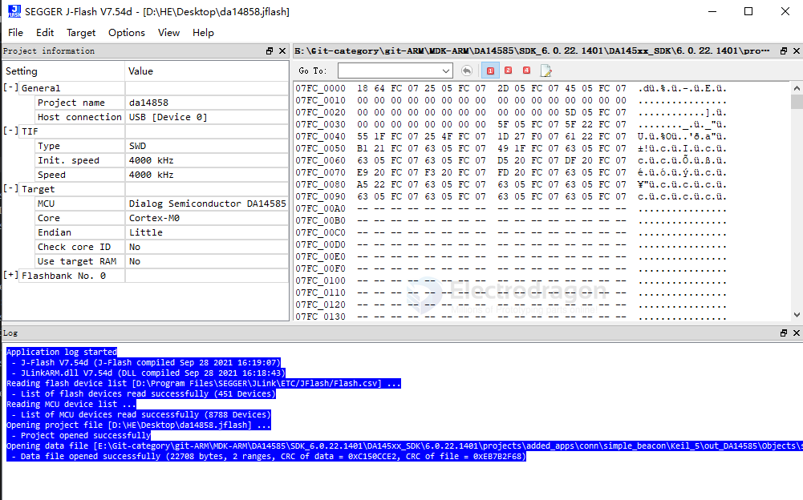

# jflash-dat

    Application log started
    - J-Flash V7.54d (J-Flash compiled Sep 28 2021 16:19:07)
    - JLinkARM.dll V7.54d (DLL compiled Sep 28 2021 16:18:43)
    Reading flash device list [D:\Program Files\SEGGER\JLink\ETC/JFlash/Flash.csv] ...
    - List of flash devices read successfully (451 Devices)
    Reading MCU device list ...
    - List of MCU devices read successfully (8788 Devices)
    Opening project file [D:\HE\Desktop\da14858.jflash] ...
    - Project opened successfully
    Opening data file [E:\Git-category\git-ARM\MDK-ARM\DA14585\SDK_6.0.22.1401\DA145xx_SDK\6.0.22.1401\projects\added_apps\conn\simple_beacon\Keil_5\out_DA14585\Objects\simple_beacon_585.hex] ...
    - Data file opened successfully (22708 bytes, 2 ranges, CRC of data = 0xC150CCE2, CRC of file = 0xEB7B2F68)

connect to a [[DA14585-dat]]

    Connecting ...
    - Connecting via USB to probe/ programmer device 0
    - Probe/ Programmer firmware: J-Link V9 compiled May  7 2021 16:26:12
    - Device "DA14585" selected.
    - Target interface speed: 4000 kHz (Fixed)
    - VTarget = 3.340V
    - Found SW-DP with ID 0x0BB11477
    - DPIDR: 0x0BB11477
    - Scanning AP map to find all available APs
    - AP[1]: Stopped AP scan as end of AP map has been reached
    - AP[0]: AHB-AP (IDR: 0x04770021)
    - Iterating through AP map to find AHB-AP to use
    - AP[0]: Core found
    - AP[0]: AHB-AP ROM base: 0xE00FF000
    - CPUID register: 0x410CC200. Implementer code: 0x41 (ARM)
    - Found Cortex-M0 r0p0, Little endian.
    - FPUnit: 4 code (BP) slots and 0 literal slots
    - CoreSight components:
    - ROMTbl[0] @ E00FF000
    - [0][0]: E000E000 CID B105E00D PID 000BB008 SCS
    - [0][1]: E0001000 CID B105E00D PID 000BB00A DWT
    - [0][2]: E0002000 CID B105E00D PID 000BB00B FPB
    - Executing init sequence ...
    - Initialized successfully
    - Target interface speed: 4000 kHz (Fixed)
    - Found 1 JTAG device. Core ID: 0x0BB11477 (None)
    - Connected successfully

## NOTE 

Jlash for flash SPI flash only 

    ERROR: Could not find CFI compliant flash device
    ERROR: Failed to check blank target
    CFI = Common Flash Interface. JFlash tries to read the flash device ID via standard commands.

It cannot detect the flash because either:

There is no external flash at 0x00000000.

The flash is connected via SPI, not a parallel memory interface, which JFlash expects.

The chip expects programming through SWD using RAM/bootloader, not direct flash mapping.

## ref 

- [[jlink-dat]]