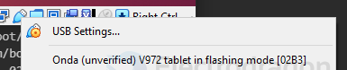

# sunxi-tools-dat

- [[uboot-dat]]



- [[F1C100-SDK-dat]] - [[V3S-dat]]

[linux-sunxi.org](https://linux-sunxi.org/D1s)


### Using `sunxi-fel` (u-boot / generic FEL):
```bash
sunxi-fel -v spl u-boot-spl.bin
sunxi-fel -v write 0x4A000000 u-boot.bin
sunxi-fel -v exe 0x4A000000
```


## for F1C100 

- [[F1C100-dat]] - [[ubuntu-dat]]

    git clone https://github.com/Icenowy/sunxi-tools.git -b f1c100s-spiflash

    make && sudo make install

check 

    root@ubuntu14:/home/vb/lpi/sunxi-tools# sunxi-fel
    sunxi-fel v1.4.1-104-g11a9d20

查看芯片信息

    sudo sunxi-fel ver
    AWUSBFEX soc=00001663(F1C100s) 00000001 ver=0001 44 08
    scratchpad=00007e00 00000000 00000000

列出所有芯片的信息

    sudo sunxi-fel -l

    root@ubuntu14:/home/vb# sunxi-fel -l
    USB device 002:004   Allwinner F1C100s 


加载并执行uboot的spl

    sudo sunxi-fel spl 文件名

把文件内容写入内存指定地址(-p是显示写入进度) sudo sunxi-fel -p

    write 地址 文件名

调用指定地址的函数

    sudo sunxi-fel exec 地址

显示spiflash的信息

    sudo sunxi-fel spiflash-info

读取spiflash指定地址的数据并写入到文件

    sudo sunxi-fel spiflash-read 地址 长度 存放数据的文件路径

写入指定文件的指定长度的内容到spiflash的指定地址

    sudo sunxi-fel spiflash-write 地址 长度 存放数据的文件路径

## programming 


1. 以 uboot file-with-spl形式进行（单次运行，测试时个人推荐）

    sunxi-fel uboot /your/path/to/u-boot-sunxi-with-spl.bin 

2. 烧进 spi-flash （开机自启）

    sunxi-fel -p spiflash-write 0 /your/path/to/u-boot-sunxi-with-spl.bin

note: 重新烧录或重进fel模式时，请在上电时拉低SPI flash 的 CS引脚

此时在串口控制台（minicom、putty或其他）输入 bdinfo

将列出各种板子信息，如：

    arch_number = 0x00000000
    boot_params = 0x80000100
    DRAM bank   = 0x00000000
    -> start    = 0x80000000
    -> size     = 0x02000000
    baudrate    = 115200 bps
    TLB addr    = 0x80FF0000
    relocaddr   = 0x80F14000
    reloc off   = 0xFF814000
    irq_sp      = 0x80E09D90
    sp start    = 0x80E09D80
    FB base     = 0x81E89000
    Early malloc usage: 118 / 400
    fdt_blob = 80e09da8


## ref 

- [[allwinner-dat]]