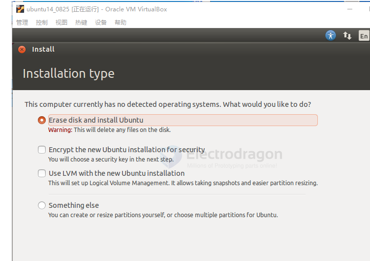
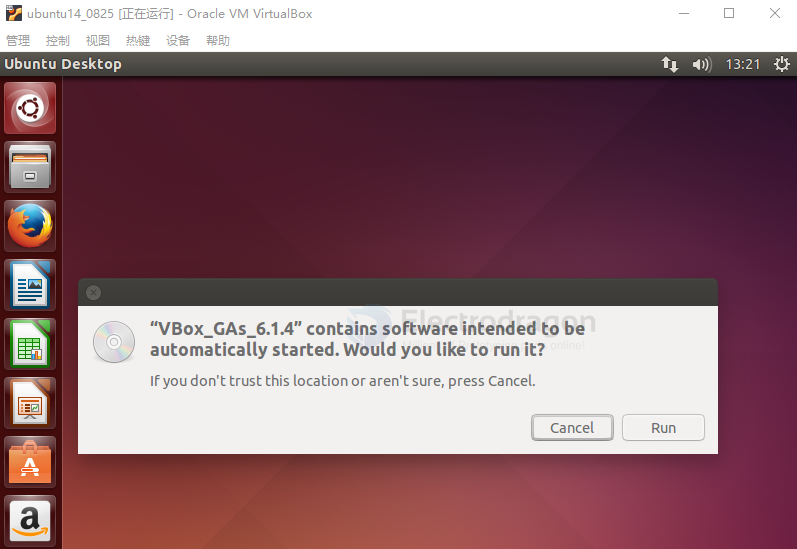
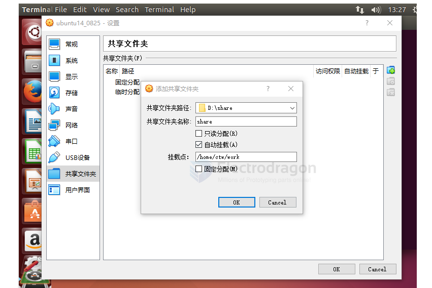

# ubuntu-dat.md

## share folder 

- 打开终端 (Open the terminal).
- 使用命令 cd /mnt 进入到 mnt 目录 (Use the command cd /mnt to enter the mnt directory).
- 使用命令 sudo mkdir share 创建 share 文件夹 (Use the command sudo mkdir share to create the share folder).
- 使用命令 sudo mount -t vboxsf share /mnt/share 挂载共享文件夹 (Use the command sudo mount -t vboxsf share /mnt/share to mount the shared folder).
- 进入到 share 目录 (Enter the share directory).
- 使用 ls 命令查看挂载结果 (Use the ls command to check the mounted folder).

## basic 

apt-get update
apt-get upgrade
apt-get install <package_name>

## dependency

    sudo apt-get install gcc make cmake rsync wget unzip build-essential git bc swig libncurses-dev libpython3-dev libssl-dev python3-distutils android-tools-mkbootimg -y

    sudo apt-get install build-essential subversion git-core libncurses5-dev zlib1g-dev gawk flex quilt libssl-dev xsltproc libxml-parser-perl mercurial bzr ecj cvs unzip lib32z1 lib32ncurses5 lib32bz2-1.0 -y

    sudo apt-get install vim flex bison texinfo u-boot-tools lib32stdc++6 libusb-1.0-0-dev mtd-utils -y

    sudo apt install libz libusb-1.0-0-dev

## SDK 

- [[tina-dat]]

## ref 

- [[virtualbox-dat]]