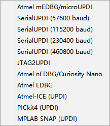

# UPDI-dat

https://create.arduino.cc/projecthub/john-bradnam/create-your-own-updi-programmer-1e55f1

power supply setup 

3.3V + 3.3_jump

## official programmer 

- ateml ICE 

## tuto - self made arduino nano as UPDI programmer 

- https://www.instructables.com/Arduino-Nano-1/

## Common Programmer in Arduino 

## Support 

- [[megaCoreX-dat]]

## Demo 

- https://t.me/electrodragon3/45

## Boards 

- [[DAR1060-dat]]