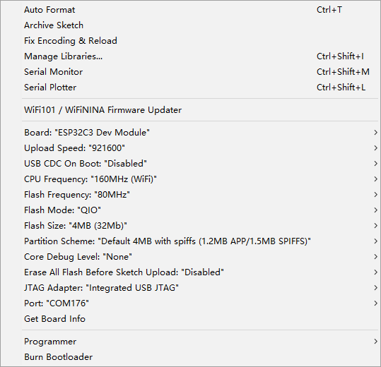

## Guide 

https://docs.espressif.com/projects/arduino-esp32/en/latest/getting_started.html#supported-soc-s

## Parameters

### ESP32 

### ESP32-C3

| Setup                                | Params                  | Note                          |     |
| ------------------------------------ | ----------------------- | ----------------------------- | --- |
| Board                                | ESP32C3 Dev Board       |                               |     |
| Upload Speed                         | 921600                  |                               |     |
| USB CDC on Boot                      | Disabled                |                               |     |
| CPU Frequency                        | 160MHz / 80Mhz          |                               |     |
| Flash Frequency                      | 80MHz / 40Mhz           | ESP flash tool speed to 40MHz |     |
| Flash Mode                           | QIO / DIO               |                               |     |
| Flash Size                           | 4MB                     |                               |     |
| Partition Scheme                     | Default 4MB with spiffs | (1.2MB APP / 1.5MB SPIFFS)    |     |
| Core Debug Level                     | None                    |                               |     |
| Erase All Flash Before Sketch Upload | Enabled                 |                               |     |

some tips:
- flash basic blink sketch into module first to erase all
- 80Mhz + 40Mhz + QIO = OK 
- 80Mhz + 40Mhz + DIO = OK 

## version 

version 2.0.6 - 2022/2/3
version 2.0.4

## repository
https://github.com/espressif/arduino-esp32

## BSP demo code 

- https://github.com/Edragon/Arduino-ESP32

includes
- bluetooth / wifi tested with official examples

- [[ESP32-SDK]]