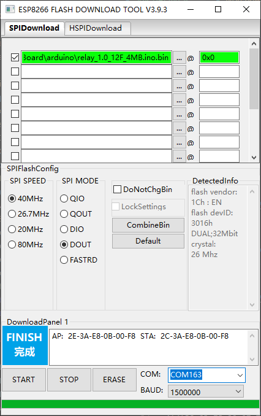
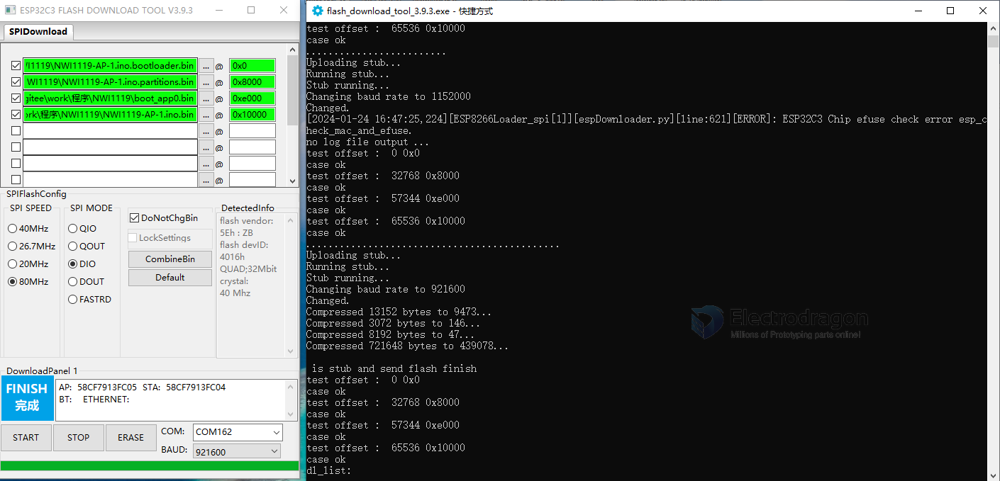

# Flash Download Tool

- download from - https://www.espressif.com.cn/en/support/download/other-tools

## ESP8266

SPI Speed 
- 40 Mhz
- 80 Mhz  

SPI Mode 
- QIO
- DIO
- DOUT

## NWI1139 

SPI = 40Mhz, SPI Mode = DOUT, speed up to 1.5M (1 500 000, for CH340)

## NWI1126 

### ESP32-C3 Factory Mode 

- Chip = ESP32-C3
- Mode = Factory
- LoadMode = UART

setup
- Flash Frequency: 40M or 80M 
- SPI Mode: QIO or DIO 

wiring with USB-TTL cable 
- Red = 5V+ Power Supply = pin1 = +5V or VCC
- Green - TXD
- White - RXD
- GND - Ground

## Common Error 

5-chip efuse check fail

## Upload 

ESP32-C3 
- flash speed 80M 
- flash mode DIO
