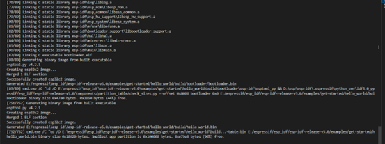

    *  Executing task: C:\Users\Administrator\.espressif\python_env\idf5.0_py3.8_env\Scripts\python.exe d:\esp-idf-v5.0\tools\idf_size.py d:\work\hello_world\build\hello_world.map 

    Total sizes:
    Used static DRAM:   12048 bytes ( 168688 remain, 6.7% used) 
        .data size:    9768 bytes
        .bss  size:    2280 bytes
    Used static IRAM:   47430 bytes (  83642 remain, 36.2% used)
        .text size:   46403 bytes
    .vectors size:    1027 bytes
    Used Flash size :  119363 bytes
        .text     :   87935 bytes
        .rodata   :   31172 bytes
    Total image size:  176561 bytes (.bin may be padded larger) 

file includes:
- bootloader.bin - 0x0
- partition_table.bin - 0x8000
- hello_world.bin - 0x10000

SPI speed 40M, SPI Mode DIO

### compile done 

