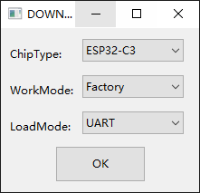
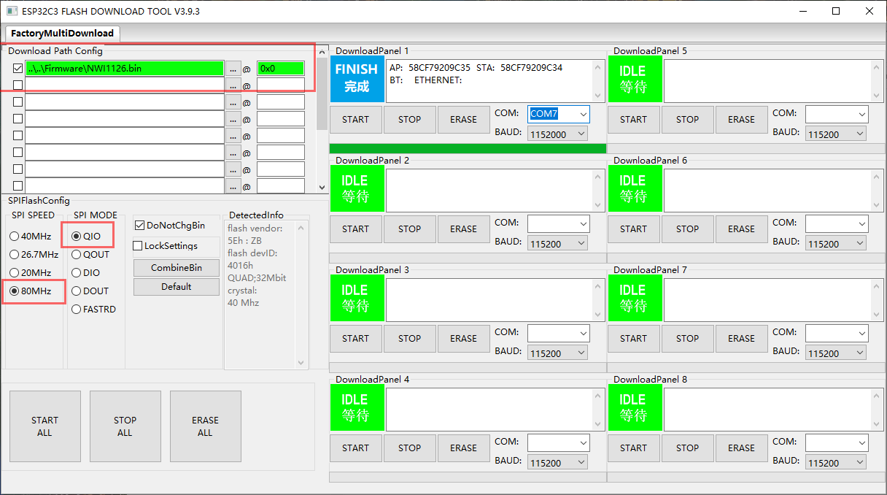
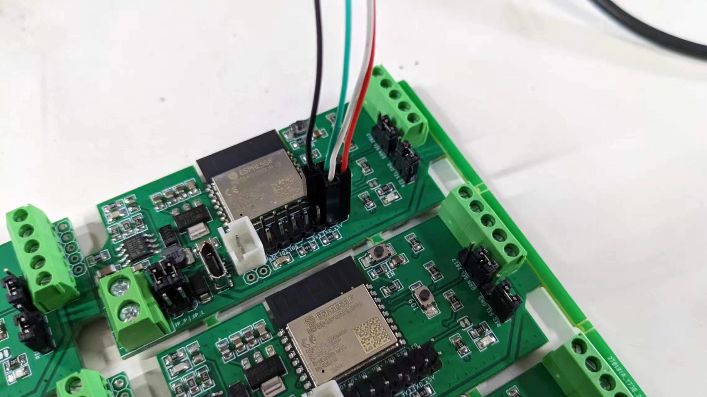

# Flash Download Tool

### ESP32-C3 Factory Mode 

- Chip = ESP32-C3
- Mode = Factory
- LoadMode = UART

### setup 设置

- Flash Frequency: 40M or 80M 
- SPI Mode: QIO or DIO 

- GND - 电源地
- 红色 5V电源正
- 绿色 - USB_TXD
- 白色 - USB_RXD

