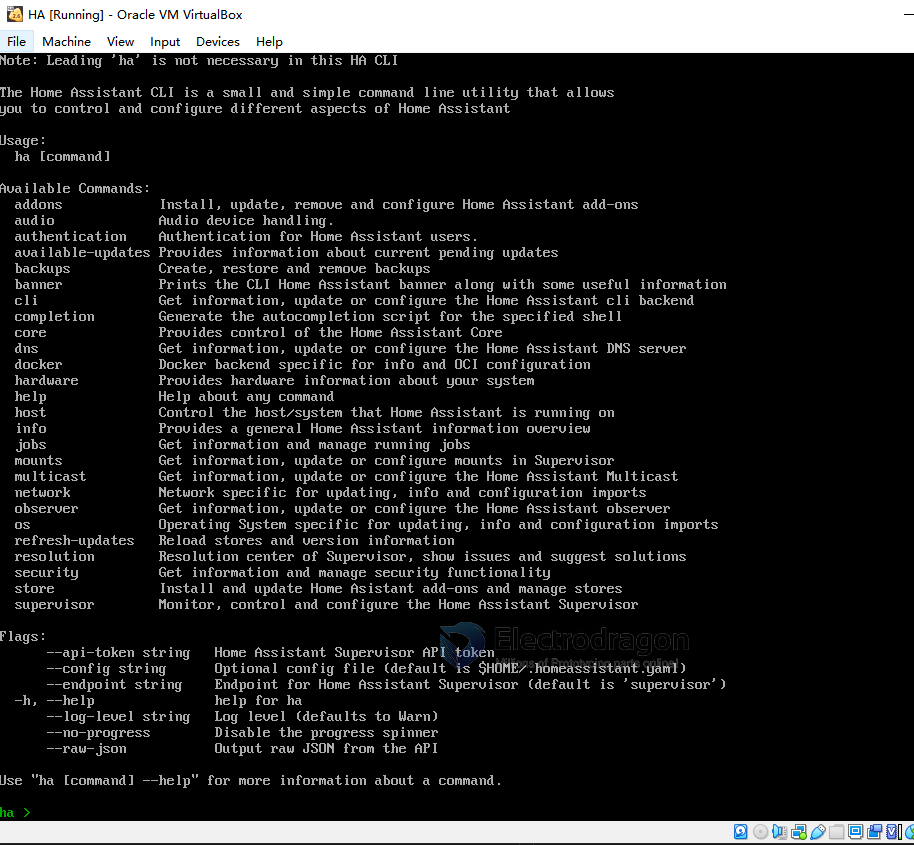
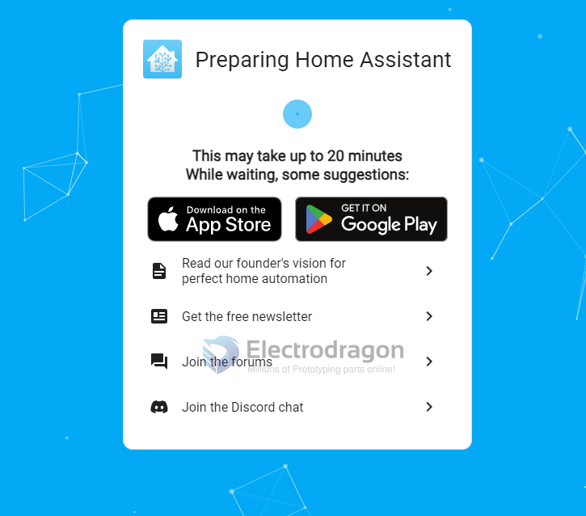

# home-assistant-dat

- https://www.home-assistant.io/installation/windows
- virtualbox 


- Create a new virtual machine.
- Select type ``Linux`` and version ```Linux 2.6 / 3.x / 4.x (64-bit)```.
- Select Use an existing virtual hard disk file, select the unzipped VDI file from above.
- Edit the Settings of the VM and go to System > Motherboard. Select ```Enable EFI```.
- Then go to Network > Adapter 1. Choose ``Bridged Adapter`` and choose your network adapter.


## ha console panel view 

    ha -h 




## HA web view

- http://homeassistant.local:8123/
- http://192.168.8.183:8123/
- http://192.168.8.183:4357/

4357 view 

    Home Assistant observer
    Supervisor:	Connected
    Supported:	Supported
    Healthy:	Healthy




## network issue 

For users in China: home assistant pulls docker image from ghcr.io 6, which is blocked in China. A free network is needed.

- can not clone 

- downloading docker image ghcr ... 

