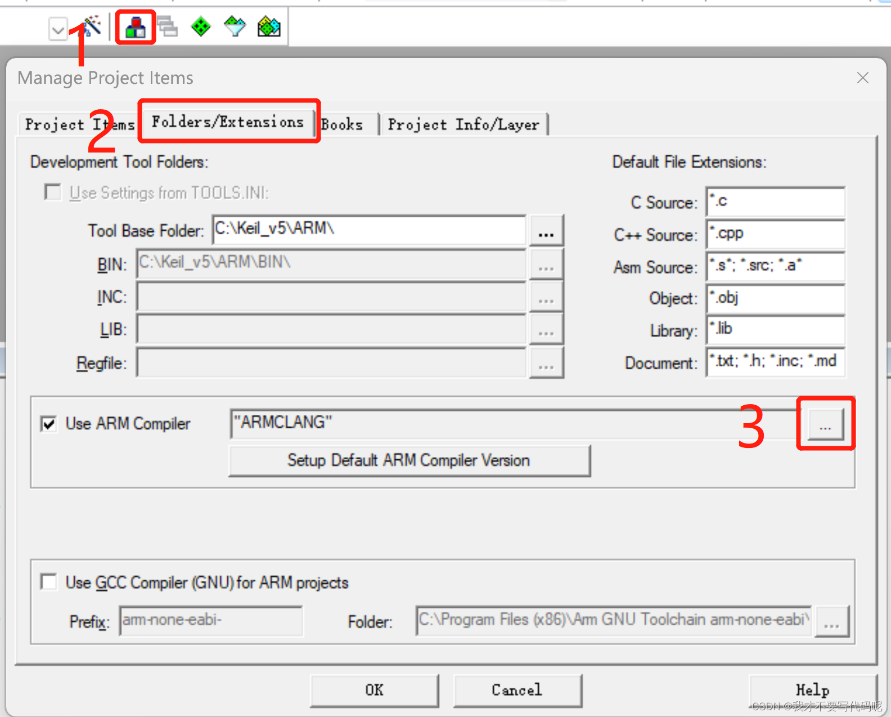
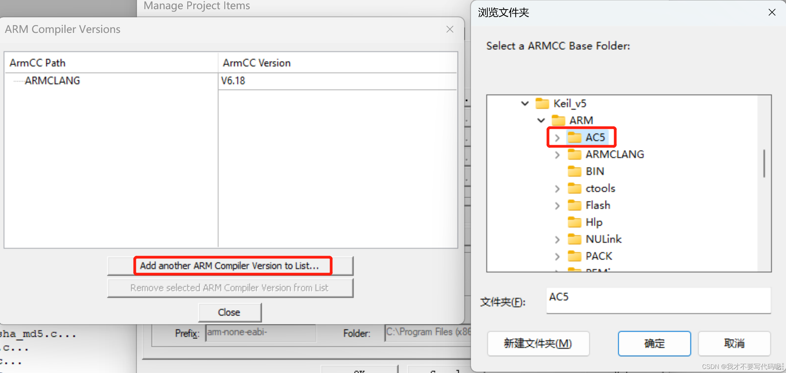

# MDK-ARM

### STMicroelectronics STM32G0 Series Device Support
    https://www.keil.com/dd2/pack/#!#eula-container

### 5.38a：
https://pan.baidu.com/s/1REHRICabWMn0gHp8bgroWQ?pwd=1122

### 许可工具，到2032年：
https://pan.baidu.com/s/11-JWIdM2-yc9T_9KCsNa9g?pwd=1122

### ARM C LANG
    - 无需安装
    - 直接改用 arm Compiler 6
ARM Compiler 5.06 update 7
链接：https://pan.baidu.com/s/1iecXSBQ0ECHruKqw1b6Cgg?pwd=1122

安装方法
在安装Keil MDK目录 Keil_v5\ARM 下新建 AC5 文件夹并安装编译器

必须安装到Keil目录中，否则会有许可问题

配置Keil MDK中工具路径，按照下图中1、2、3步选中。

*** Target 'GPIO_IOToggle' uses ARM-Compiler 'Default Compiler Version 5' which is not available.

## DFP

### F0
- https://keilpack.azureedge.net/pack/Keil.STM32F0xx_DFP.2.1.1.pack

### F1
- https://keilpack.azureedge.net/pack/Keil.STM32F1xx_DFP.2.4.0.pack

