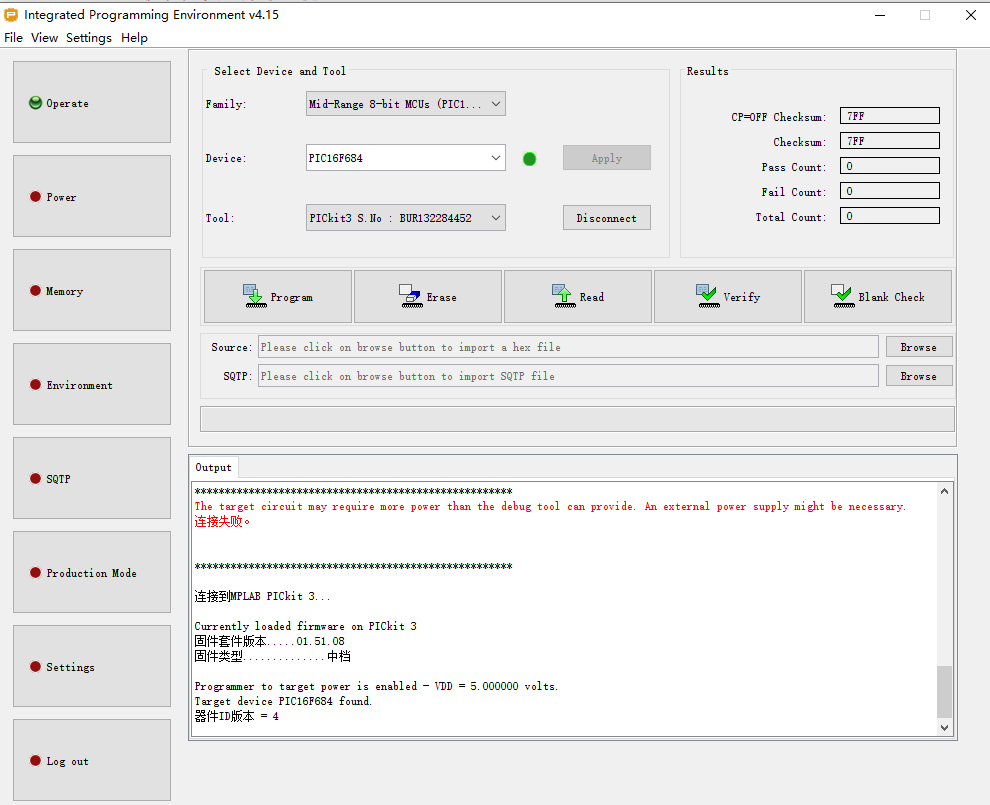
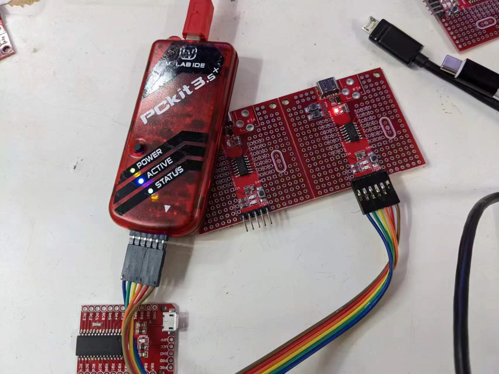
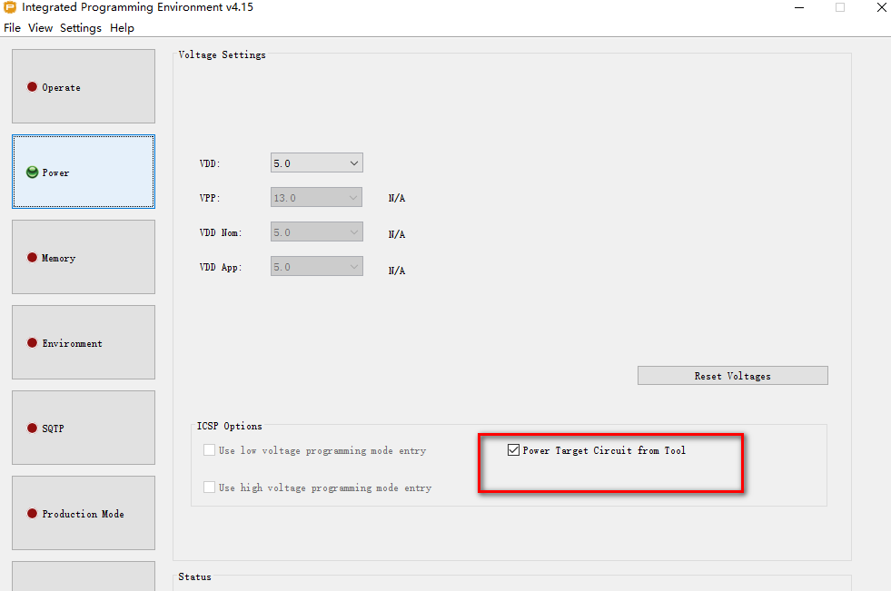
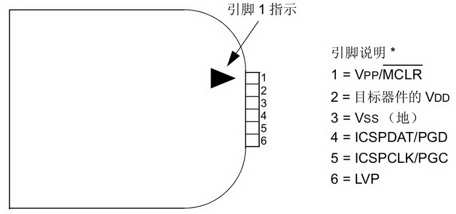

### mplabX
    - v2.3 = 377MB
    - MPLAB X IDE
    - MPLAB IPE - programming tool
    - v4.05
    - v4.15
    - https://microchipdeveloper.com/ipe:installation

### further install compiler 
- MPLAB XC8 Compiler
- MPLAB XC16 Compiler
- MPLAB XC32 Compiler

### MPLAB X Harmony 

### PICC
    - 9.8.3

### Programming PIC16F684

### Programming PIC16F72

- power option: 

    *****************************************************

    连接到MPLAB PICkit 3...

    Currently loaded firmware on PICkit 3
    固件套件版本.....01.51.08
    固件类型..............中档

    Programmer to target power is enabled - VDD = 5.000000 volts.
    Target device PIC16F72 found.
    器件ID版本 = 2

### code
https://e_dragon@bitbucket.org/e_dragon/pic.git

### PICKIT

