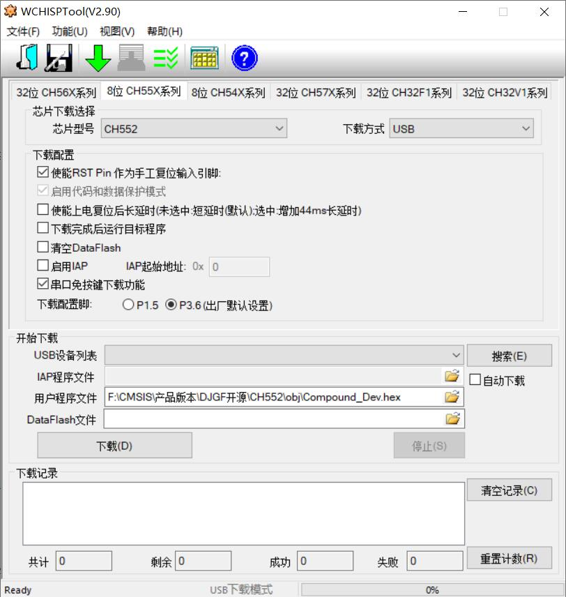
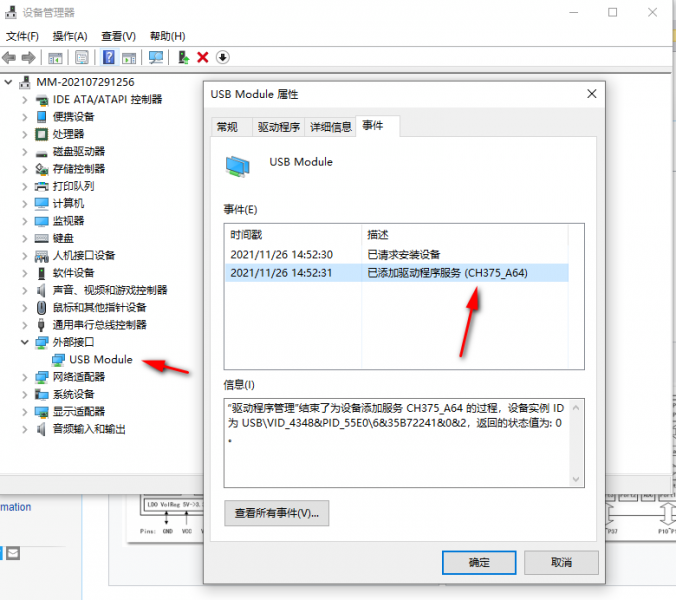
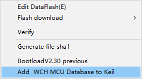

# WCHISPTool 

- via USB port 
- http://www.wch-ic.com/downloads/WCHISPTool_Setup_exe.html

## CH559

## CH552

## USB module detect 
* Find "external Interface" -> USB Module in device manager, not COM port serial interface

## add to keil from WCHISPTool 

