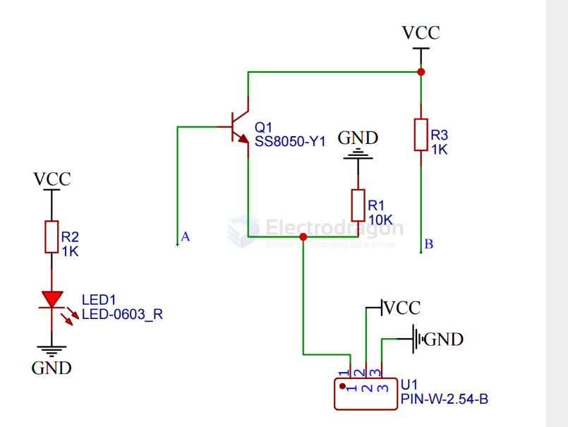
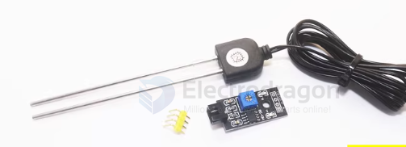
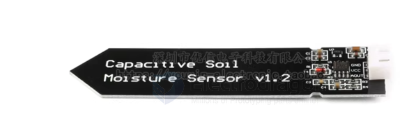

# sensor-soil-moisture-dat

- [[sensor-soil-dat]]

## board 

- [[STH1052-dat]] - soil moisture sensor board

## working principles 

The principle of detecting soil moisture is mainly **based on measuring how the presence of water affects the electrical or physical properties of the soil**. The most common types are as follows:

---

### 🌱 1. Resistive (Conductivity-Based) Principle
**Principle:**  
The more water in the soil, the higher its conductivity (lower resistance) because water contains electrolytes. When the soil is dry, resistance increases.

**How it works:**  
- Two metal probes are inserted into the soil.  
- A small voltage is applied across them.  
- The resulting current or resistance is measured and converted to moisture content.

**Advantages:** Simple, inexpensive, fast response.  
**Disadvantages:** Electrodes corrode easily, affected by soil salinity, limited long-term stability.

土壤湿度传感器模块有两个铜条是传感器探头，将它们插入土壤时，它们可以检测到土壤的水分，土壤湿润，导电性越好，反映出它们之间的电阻越低，土壤干燥,导电性就相对差一点,因此他们之间的电阻越高，它是模拟传感器，因此我们通过模拟输入获得电压值，因为土壤的湿度可以分为几个等级，当我们使用土壤湿度传感器做一个自动浇花系统的时候，将方便的使用。

SCH 

code 

    void setup(){
    Serial.begin(9600);
    pinMode(A0, INPUT);
    }

    void loop(){
    delay(1000);
    Serial.println(analogRead(A0));

    }

anti-rust probe 

### 🌾 2. Capacitive Principle
**Principle:**  
The dielectric constant of water (~80) is much higher than that of dry soil (~4) or air (~1).  
As soil moisture increases, the dielectric constant of the soil rises, and the sensor’s capacitance increases.

**How it works:**  
- The sensor forms a capacitor (with metal probes or plates).  
- The capacitance change is measured and calibrated to indicate moisture level.

**Advantages:**  
- No direct electrical contact with soil (non-corrosive).  
- High stability, suitable for long-term monitoring.  

**Disadvantages:**  
- Slightly higher cost.  
- Requires high-frequency measurement circuitry.

#### type of capacitive soil moisture sensor

新款土壤湿度传感器！这款电容式土壤湿度传感器区别于市面上绝大部分的电阻式传感器，采用电容感应原理来检测土壤湿度。避免了电阻式传感器极易被腐蚀的问题，极大地延长了它的工作寿命。

传感器内置稳压芯片，支持3.3~5.5V宽电压工作环境，这意味着即使在3.3V的主控板上，它也能正常工作。Raspberry Pi之类的微型PC，只需要外接一个ADC（模拟信号转数字信号）转换模块就可以工作。

外接一块屏幕，一块主板，你就可以和你的植物对话啦！看看心爱的它是不是渴了，需不需要多一点水的滋润。

- 工作电压: 3.3 ~ 5.5 VDC
- 输出电压: 0 ~ 3.0 VDC 
- 湿度大时电压小，湿度小时电压大，请回去用万用表测量确认。
- 接口: PH2.54-3P
- 尺寸: 98 x 23mm (LxW)  

### 🌿 3. Time Domain Reflectometry (TDR)

**Principle:**  

The propagation speed of an electromagnetic pulse in soil depends on the soil’s dielectric constant, which varies with moisture content.  
More water → higher dielectric constant → slower signal propagation.

**How it works:**  
- A high-frequency pulse is sent along probes.  
- The reflection time or waveform change is measured.  
- The dielectric constant is calculated and converted into volumetric water content.

**Advantages:** Very accurate, measures volumetric water content.  
**Disadvantages:** Expensive and complex equipment.

---

### 🍂 4. Neutron Scattering Method (Scientific Use)
**Principle:**  
Fast neutrons are slowed down when they collide with hydrogen atoms (mainly from water molecules).  
The number of slow neutrons detected indicates the soil water content.

**Advantages:** Extremely accurate.  
**Disadvantages:** Very expensive, requires radioactive sources, strict safety requirements.

---

### ✅ Comparison Table

| Type | Measurement Basis | Accuracy | Cost | Stability | Characteristics |
|------|--------------------|----------|------|------------|----------------|
| Resistive | Conductivity | ★★ | Low | ★ | Simple but corrodes easily |
| Capacitive | Dielectric constant | ★★★ | Medium | ★★★ | Stable, most commonly used |
| TDR | Electromagnetic wave velocity | ★★★★★ | High | ★★★★★ | High precision, research use |
| Neutron | Hydrogen atom count | ★★★★★ | Very High | ★★★★ | Laboratory / scientific use |

## ref 

- [[sensor-dat]]