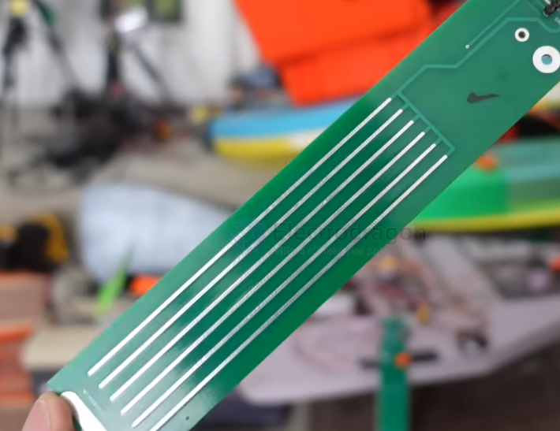
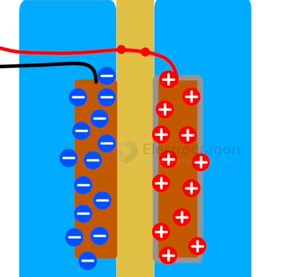
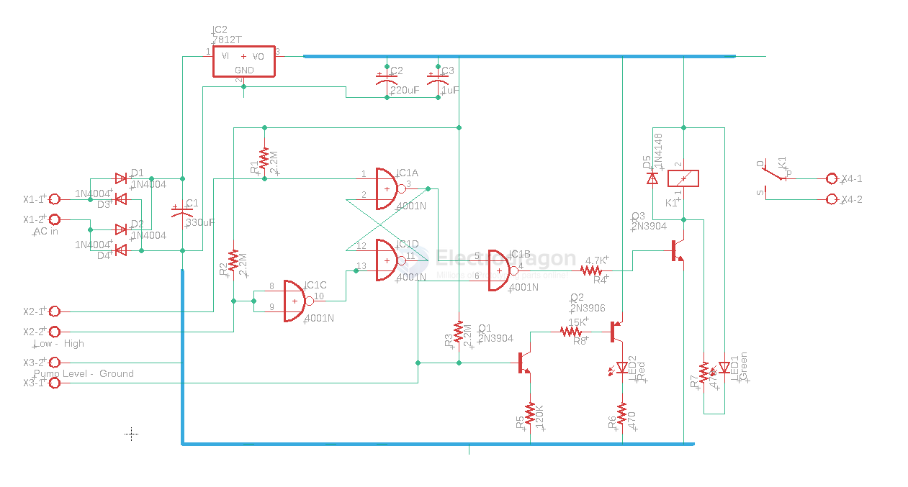

# sensor-water-level-dat.md

## resistance water level sensor - easy rust 

design a simple water level sensor, positive on the front and negative on the back 

## capacitance water level sensor design 

## water level sensor SCH1 

- [[pump-dat]]

- [[CD4001-dat]]

## ref 

- [[sensor-dat]]