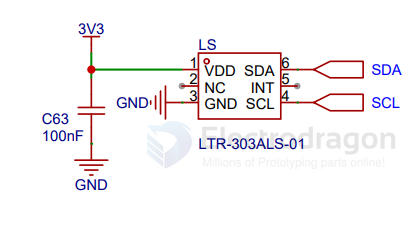
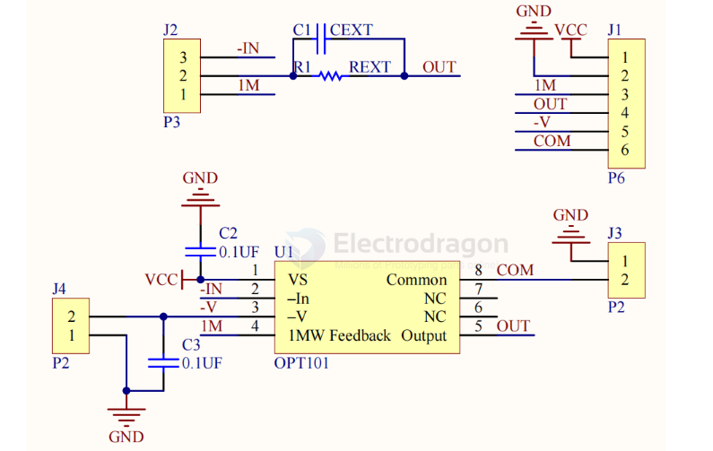

# sensor-light-dat

- legacy wiki page - https://w.electrodragon.com/w/Category:Light_Sensor

- [[ams-osram-dat]] - [[sensor-ambient-light-dat]]

- [[sensor-UV-light-dat]] - [[LDR-dat]]

- [[infrared-reflective-dat]]

- [[sensor-light-dat]] - [[light-dat]]

## chip 

- [[liteon-dat]] - [[LTR-303ALS-dat]] - [[sensor-light-dat]]

The LTR-303ALS-01 is a low voltage I2C digital light sensor [ALS] in a low cost miniature chipled lead-free surface mount package. This sensor converts light intensity to a digital output signal capable of direct I2C interface. It provides a linear response over a wide dynamic range from 0.01 lux to 64k lux and is well suited to applications under high ambient brightness.

There are altogether six gain settings (1X, 2X, 4X, 8X, 48X and 96X) available for user to configure.

## light sensor 

- [[SMO1090-dat]] - [[SSL1034-dat]] - [[SSL1053-dat]]

- [[SSL1022-dat]]

## light density chip

- [[BH1750-dat]]

SCH 

## SCH 

photocell - LDR - ESP32 

## OPT101

OPT101是具有片上跨阻抗放大器的单片光电二极管。单个芯片上的光电二极管和跨阻放大器的组合消除了离散设计中常遇到的问题，例如漏电流误差，噪声拾取和增益峰化杂散电容的结果。输出电压随光强度线性增加。该放大器设计用于单电源或双电源操作。

产品特征：
单电源：2.7-36V
2.光电二极管尺寸：2.29mm*2.29mm
3.内部1Mohm反馈电阻
4.高响应：0.45A/W（650nm）
5.宽度：14Khz
6.低峰值电流：120UA

产品应用：
1.医学仪器
2.实验仪器
3.位置和接近传感器
4.照相分析仪
5.条码扫描器
6.检测器
7.货币兑换

## ref 

- [[sensor-dat]]

- [legacy wiki page ](https://w.electrodragon.com/w/Photosensitive_sensor)