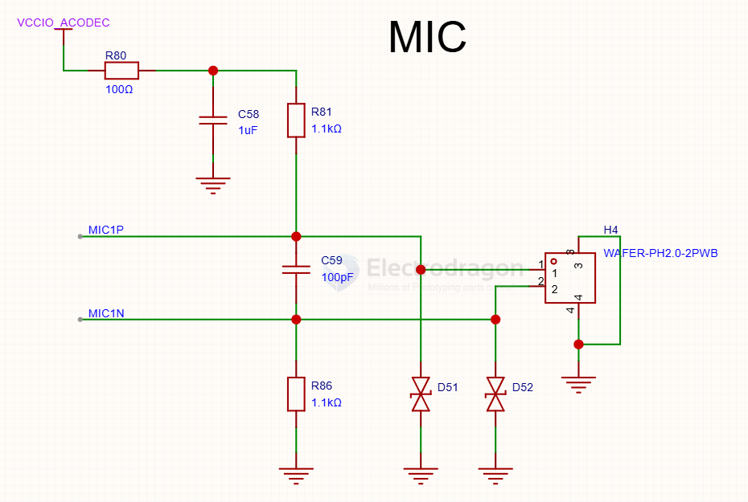
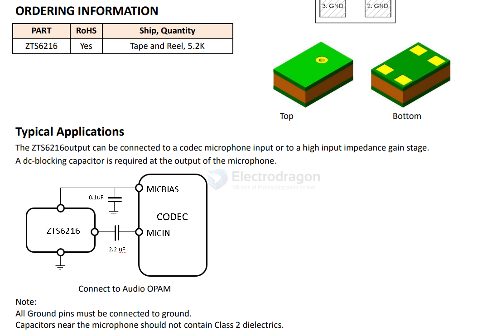

# sensor-microphone-Analog-dat.md

- [[sensor-microphone-I2S-dat]] - [[sensor-microphone-Analog-dat]]

- [[MAX9812-dat]]

- [[Electret-Condenser-Microphone-dat]]

- [[audio-dat]]

## build 

## analog 

LMA3722T421-OA5

ZTS6216 - Ultralow Noise Microphone with Top Port and Analog Output

MSM381AKT003

## ref 

- [[sensor-microphone-dat]]

