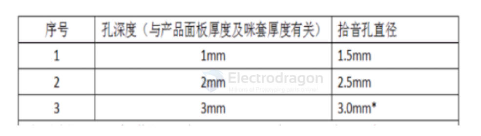
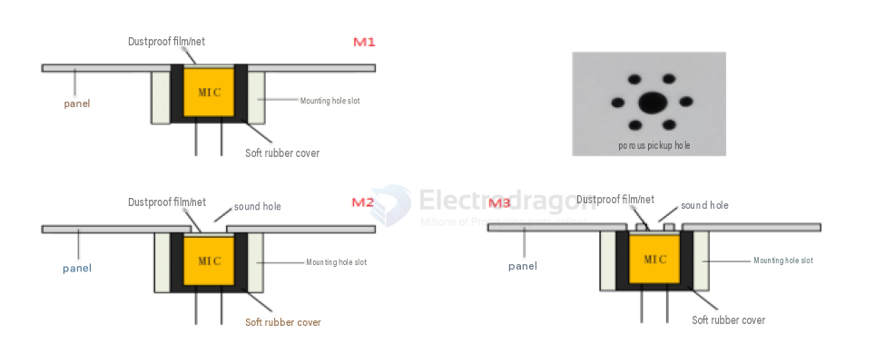
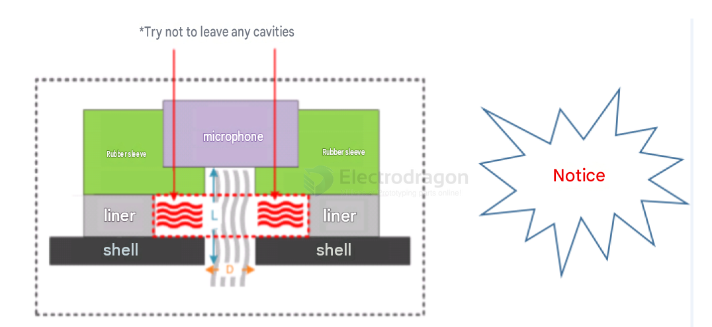
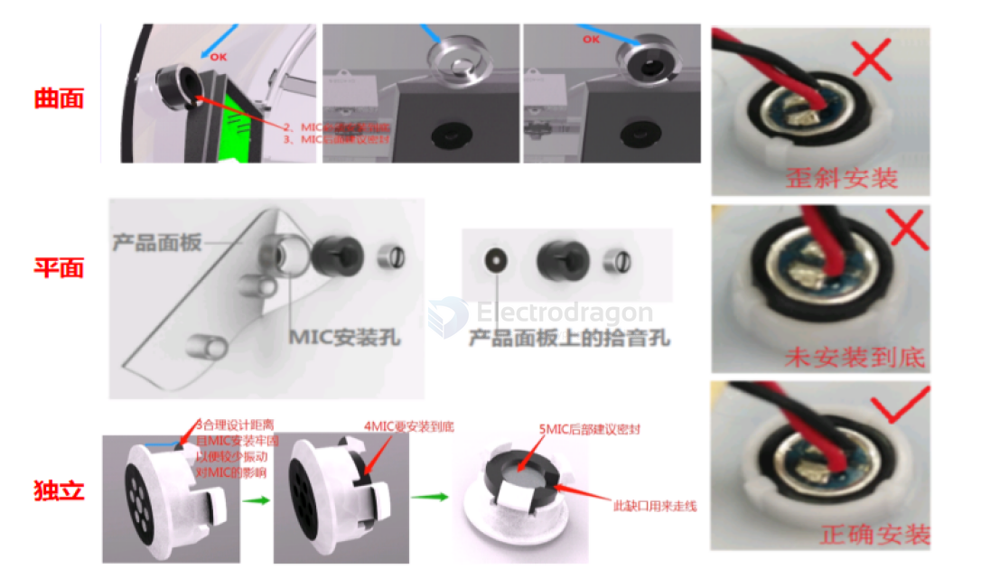

# sensor-microphone-dat

- [[sensor-microphone-dat]] - [[speaker-dat]] - [[buzzer-dat]]- [[I2S-dat]] - [[audio-dat]]

- [[sensor-microphone-I2S-dat]] - [[sensor-microphone-Analog-dat]]

- [[sensor-microphone-Analog-dat]] - [[Electret-Condenser-Microphone-dat]]

- [[sensor-microphone-I2S-dat]]

- [[interface-dat]] - [[I2S-dat]] - [[PDM-dat]] - [[sensor-microphone-dat]]

## chips 

- [[memsensing-dat]] - [[sensor-microphone-dat]] - [[zilltek-dat]] - [[linkmems-dat]]

- [[sensor-microphone-dat]] - [[motor-driver-dat]] - [[LM358-dat]]

## boards 

- [[SSL1017-dat]] 

- [[SSL1011-dat]] - [[SSL1012-dat]]

- [[SSL1032-dat]]

| Feature           | Electret Condenser Microphone (ECM)           | MAX9812                                  | ICS-41434                                   |
| ----------------- | --------------------------------------------- | ---------------------------------------- | ------------------------------------------- |
| **Type**          | Analog, capacitive (with FET)                 | Analog (with AGC)                        | Digital (MEMS, I2S)                         |
| **Powering**      | Requires bias voltage (1.5V to 10V)           | Requires 2.7V to 3.6V (integrated power) | Requires 1.8V to 3.6V (integrated power)    |
| **Signal Output** | Analog                                        | Analog output (with AGC)                 | Digital output (I2S)                        |
| **Amplification** | Needs external amplifier or preamp            | Built-in amplification with AGC          | Built-in digital conversion (I2S)           |
| **Size**          | Larger, with external components              | Small, integrated AGC                    | Very compact, MEMS-based                    |
| **Technology**    | Traditional electret condenser                | Integrated analog microphone with AGC    | MEMS technology (digital)                   |
| **Use Case**      | General-purpose audio recording, comm systems | Voice recording, audio applications      | Portable devices, IoT, consumer electronics |

- **Powering**: ECMs need a bias voltage to function, whereas the MAX9812 and ICS-41434 use internal power supplies (usually lower voltage).
- **Signal Output**: ECMs give an analog output that often requires additional processing, while the MAX9812 provides analog output with built-in gain control, and the ICS-41434 outputs a digital signal (I2S) directly.
- **Technology**: ECMs use a traditional electret condenser design with a FET, while the MAX9812 is an analog microphone with AGC, and the ICS-41434 uses MEMS technology.

## capacitor and reading 

- [[capacitor-dat]] - [[capacitor-dc-blocking-dat]] - [[capacitor-MLCC-dat]] - [[sensor-microphone-dat]] - [[filter-high-pass-dat]]

### Isolate the AC Audio Signal (DC-Blocking Capacitor)
* **Why it's needed:** The microphone’s internal pre-amplifier (PA) outputs an AC audio signal riding on top of a DC bias voltage. Direct connection to an ADC or an amplifier could damage the receiving chip or saturate the signal.
* **What to use:** Place a non-polarized ceramic capacitor of **at least $1\mu\text{F}$** (such as an 0805 X5R/X7R capacitor rated for 10V or higher) in series with the **OUT** pin. 
* **The result:** The capacitor acts as `a high-pass filter`, blocking the DC voltage and allowing only the shifting AC audio waveform (centered around $0\text{V}$) to pass through to your reading device.

---

### 3. Reading the Output Signal
Once the signal passes through the $1\mu\text{F}$ capacitor, you can read it in several ways depending on your application:

#### Option A: Reading with a Microcontroller (MCU) ADC (e.g., ESP32, Arduino)

- [[voltage-divider-dat]] - [[sensor-microphone-dat]]

Since standard microcontroller ADCs cannot read negative voltages (and the AC signal after the capacitor swings above and below $0\text{V}$), you must **add a DC bias offset** (typically $V_{CC}/2$):
1. **Create a Voltage Divider:** Connect two equal resistors (e.g., $10\text{ k}\Omega$ to $100\text{ k}\Omega$) between your MCU's $3.3\text{V}$ line and Ground. 
2. **Bias the Signal:** Connect the middle node of the voltage divider to the output side of your $1\mu\text{F}$ capacitor. 
3. **Read:** Connect this biased line directly to the MCU's Analog Input (ADC) pin. The audio signal will now oscillate around $1.65\text{V}$ (safe for the ADC to read and sample).

#### Option B: Reading with an Audio Amplifier or Codec

- [[BK2716-dat]] - [[codec-dat]] - [[voltage-divider-dat]] - [[sensor-microphone-dat]]

If you are sending the audio to a speaker, headphones, or a dedicated audio chip:
* Connect the output of the $1\mu\text{F}$ capacitor directly to the **MIC_IN** or line-in pin of an audio pre-amplifier (like the BK2716 amplifier referenced in the datasheet's test setup) or an audio codec chip. These chips usually have built-in high-impedance inputs designed exactly for these signals.

#### Option C: Measuring with Lab Instruments (Oscilloscope / Multi-Analyser)

- [[Oscilloscope-dat]] - [[voltage-divider-dat]] - [[sensor-microphone-dat]]

- [[BK3160-dat]]

To visualize or analyze the raw audio waveform:
* Connect the Ground probe of your oscilloscope/analyzer (e.g., BK3160 Multi-Analyser) to the circuit Ground.
* Connect the active probe to the output side of the $1\mu\text{F}$ capacitor. 
* Set the oscilloscope channel to **AC Coupling** and adjust the scale to millivolts ($mV$), as the typical sensitivity of the microphone is around $-42\text{ dB}$ ($7.9\text{ mV}$ RMS at a standard loud volume of $94\text{ dB SPL}$).

## Selection Guide

### Microphone Selection Guide

1. Choose analog microphones with sensitivity of **-27 ± 3dB** and SNR > **70dB**.
2. Select single or dual-microphone solution based on application requirements. Contact our technical team for recommendations.
3. Common microphone sleeves are **7mm or 10mm**. Use 7mm for most products; if vibration is present during operation, use 10mm sleeves. Specify connector type, cable length, and other specifications as needed.

---

### Enclosure Hole Design Guidelines

1. A sound inlet hole is required. The hole diameter depends on the hole depth (enclosure thickness). Recommended dimensions:

   

2. Place the microphone hole on the **front side** of the product, facing the user, to maximize sound pickup range. Avoid obstructions from other components.
3. Consider **waterproof and dustproof** requirements. If the environment has splashing water or dust, select a waterproof/dustproof microphone.
4. Keep away from **water inlets/outlets, air vents, mechanical parts, speakers, electromagnetic sources, and high-voltage lines** that may introduce noise. For best recognition, measure steady-state noise at the microphone position during operation — keep it below **60dB** using a sound level meter.
5. Design a **mounting hole or slot** that matches the microphone sleeve outer diameter (7mm or 10mm). Note that sleeve dimensions vary by manufacturer — confirm the slot size with the microphone supplier. Typically, the slot should be **0.1–0.2mm smaller** than the overall microphone diameter.
6. Route the microphone cable conveniently and keep it **away from high-voltage lines** — do not bundle them together.
7. For dual-microphone setups, the recommended distance is **4cm** (center-to-center). Contact our FAE for other spacing requirements.
8. For products with **AEC (Acoustic Echo Cancellation)**, keep the microphone as far from the speaker as possible. Speaker sound level at the microphone should not exceed **83dB**; speaker output should not exceed **95dB**.
9. It is recommended to **consult our technical team** before finalizing the enclosure design.
10. Avoid having a **cavity** between the sound inlet hole and the microphone. If needed for appearance, use a **plum-blossom hole pattern** instead.

---

### Microphone Installation Guidelines

1. The microphone must be **firmly secured** — any looseness will degrade recognition performance.
2. Use **RoHS-compliant RTV silicone rubber**. Recommended types: **703, 704, 737**, or other organic materials.
3. Insert the microphone **fully into the mounting hole** without tilting. Align the center of the sound inlet hole with the microphone's center.
4. **Silicone potting thickness** should be less than **3mm**. Full curing at room temperature typically takes **8–12 hours**. For thicknesses over 3mm, cure time increases — apply in multiple thin layers to ensure full curing and a stable seal. Consider advancing the microphone mounting step in production.
5. **Do not use hot glue** to secure the microphone head. Under gravity from the cable, the microphone may tilt before the adhesive fully cures. Also ensure the microphone connector cable is properly strain-relieved.

## models 

咪头选型推荐:
- 现在机芯智能咪头 6027-直径6MM，高度2.7MM，灵敏度-27dB，信噪比75
- 咪头线设计尽量短，尽量不要大于100MM，如果一定需要加长引线，请使用屏蔽线来防干扰
- 咪头电流0.1ma到0.5ma，管芯选好一点的
- 咪头灵敏度推荐在-32dB到-25dB范围内选型，信比70以上
- 具体根据用户使用场景或者环境测试为准

## ref 

- [[LM393-dat]] - [[I2S-dat]]