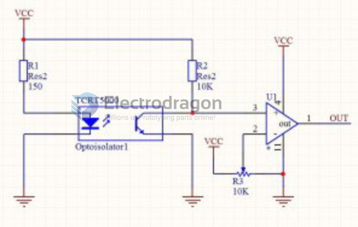
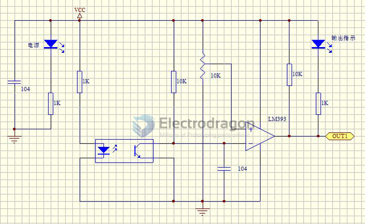
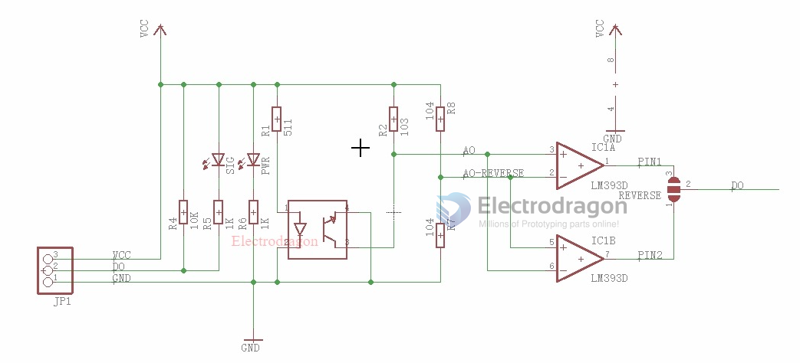
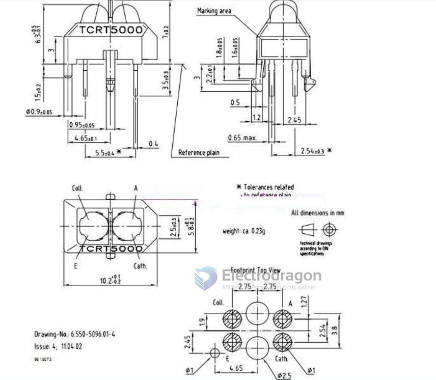
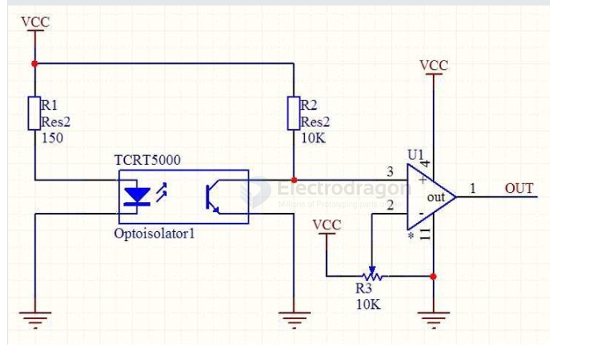
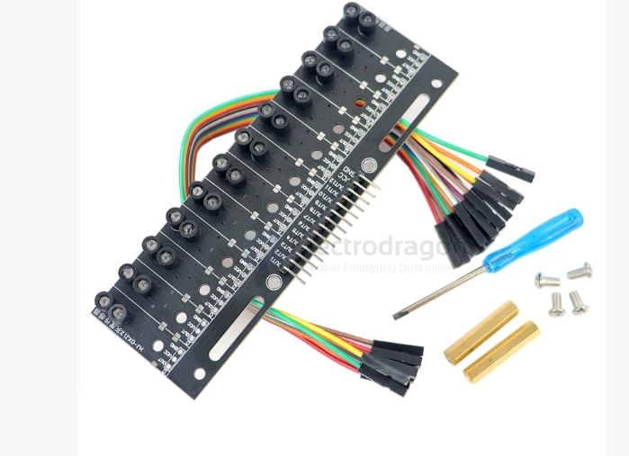

# TCRT5000-dat

Description

The TCRT5000 and TCRT500L are reflective sensors which include an infrared emitter and phototransistor in a leaded package which blocks visible light. The package includes two mounting clips. TCRT5o0oL is the long lead version.

[legacy wiki page](https://www.electrodragon.com/w/TCRT5000)

## TCRT5000 Module SCH 

full module SCH 

## TCRT5000 specs 

## TCRT5000

## ref 