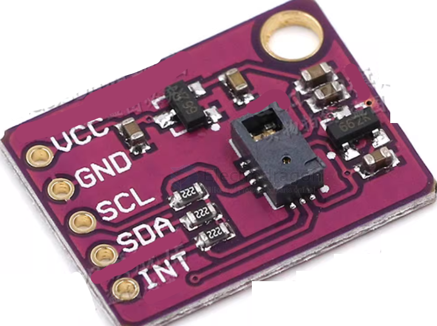

# sensor-gesture-dat

- [[SSL1045-dat]] - [[SSL1042-dat]] - [[APDS-9960-dat]] - [[APDS-9930-dat]] - [[sensor-gesture-dat]] - [[avago-dat]] 

- [[10DOF-dat]]

## PAJ7620U2

7620手势识别传感器是将手势识别功能与通用12C接口、集成到单个芯片中的PAJ7620U2。

它可以识别9种手势，包括

- 向上移动，
- 向下移动，
- 向左移动，
- 向右移动，
- 向前移动，
- 向后移动，
- 顺时针方向，
- 圆周－逆时针方向，
- 向下，
- 向下，
- 从左到右，
- 从左到右。

手势信息可以通过I2C总线访问。

7620手势识别传感器模块设计核心芯片为PAJ7260u2，是一个支持与I2C协议通信的身体红外识别IC

### features

- 9种手势识别
- 手势速度在正常模式下为 60°/s至600°/s，游戏模式为60°/ s至1200° / s
- 环境光免疫力：<100kLux
- 内置接近检测
- I2C接口高达400kbit/ s

## ref 

- [[sensor-motion-dat]] - [[10DOF-dat]]

