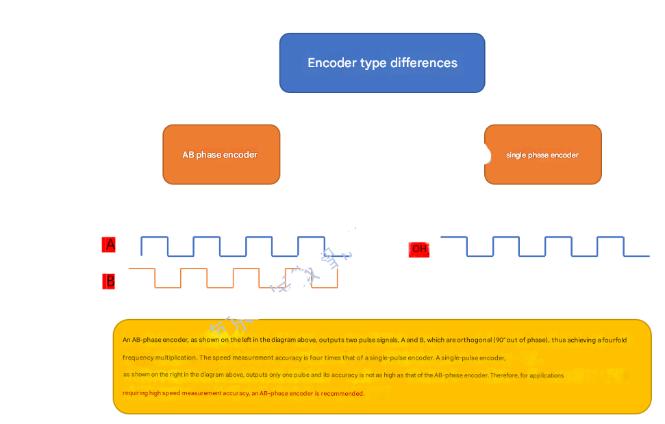
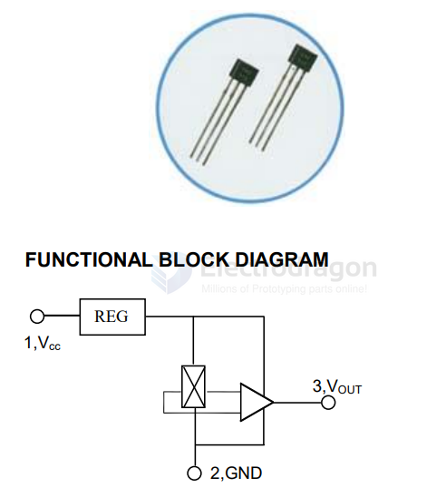
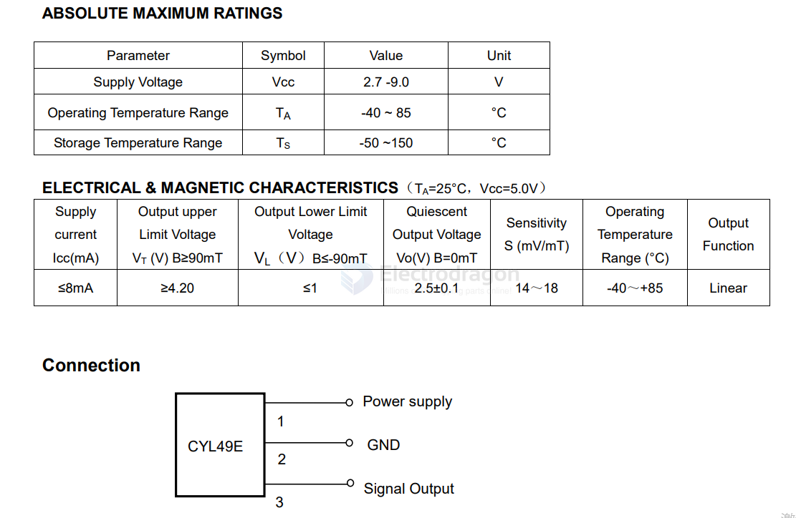
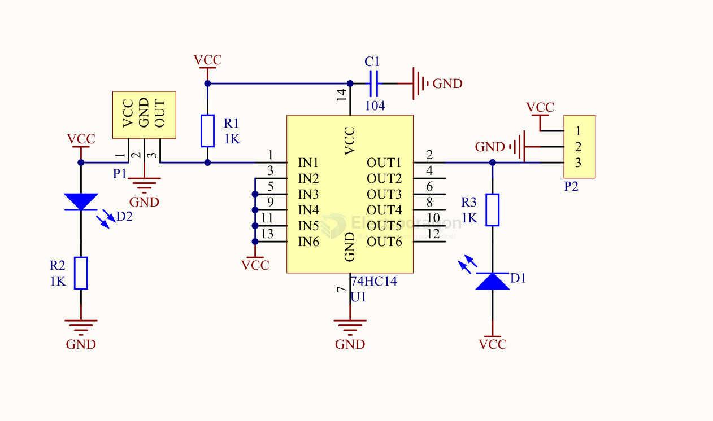
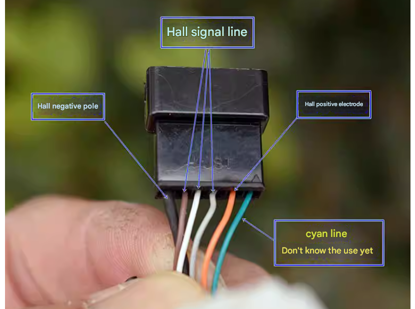

# sensor-hall-dat

## board 

- [[SMO1063-dat]] - [[SMO1016-dat]] - [[sensor-hall-dat]]

## hall-switch-dat

- **Omnipolar Operation (North or South Pole)**

AH1911/AH1921

ULTRA-LOW POWER DIGITAL OMNIPLOAR HALL-EFFECT SWITCH

https://www.diodes.com/datasheet/download/AH1911.pdf

The AH1911/AH1921 is an ultra-low power digital Omnipolar Hall Effect switch IC from Diodes broad Hall Effect switches family. 

Thanks to the hibernating clocking system, the average supply current is only 1.6μA at 3V, which makes the AH1911/AH1921 perfectly fit battery-powered consumer products, Gas or water meter, smoke detectors and IoT devices. 

The wider range of supply voltage (1.6V to 5.5V) extends battery operating time and supports low voltage system microcontrollers, which provides great flexibility for system design. 

The advanced chopper stabilized design provides superior stability on switch operating point over temperature and supply voltage. The high ESD level up to 6kV helps to improve the system robustness. 

## motor with hall sensor 

- [[motor-hall-dat]]

The AB phase encoder (left side of the diagram) outputs two pulse signals, A and B, which are orthogonal (90° out of phase), achieving a fourfold frequency harmonic. The speed measurement accuracy is four times that of a single-pulse encoder.

A single-pulse encoder (right side of the diagram) outputs only one pulse and has lower accuracy than the AB phase encoder. Therefore, for applications requiring high speed measurement accuracy, the AB phase encoder is recommended.

## 49E Linear Hall Effect Sensor

49E linear Hall-effect integrated circuit is based on Hall-Effect principle, which includes a voltage regulator, Hall-voltage generator, linear amplifier, and emitter-follower output stage. The output of the ICs changes linearly with the magnetic flux density that should be measured.

TYPICAL APPLICATION
-  Motion Detector
-  Gear Tooth Sensors
-  Proximity Detector
-  Speed Regulator for Sports Appliance
-  Current Detecting Senso

## chip 

US1881LUA-AAA-000-BU - Board Mount Hall Effect / Magnetic Sensors 3 wire Latch

WCS2800 - Hall Effect Base Linear Current Sensor

* A3212
* EST248

## more chips  

3144 - Surface mount 44E SOT23 Hall element A3144E sensor, unipolar HAL3144E switch type

- datasheet == [[3144_datasheet.pdf]]

CC6207ST SOT-23 Omnipolar Low-Power Hall Effect Switch Sensor

## SCH 

hall sensor module 

## integrated hall sensor in motor 

- 6 wires 

## ref 

- [[sensor-motion-dat]]

- [[switch-dat]]