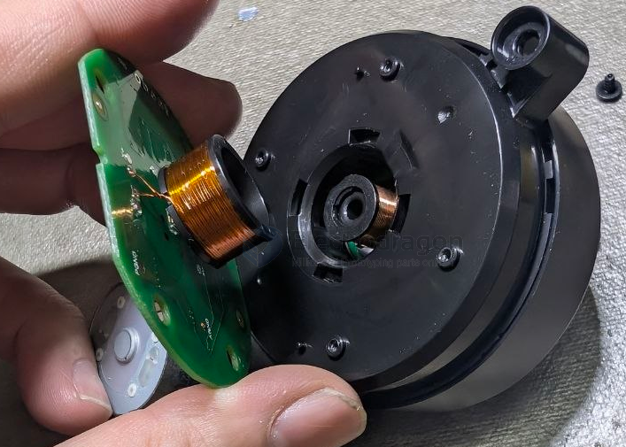
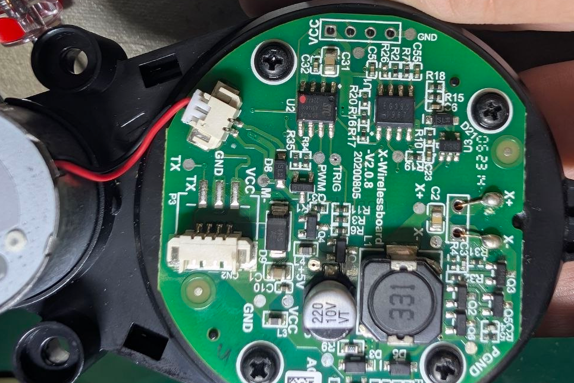
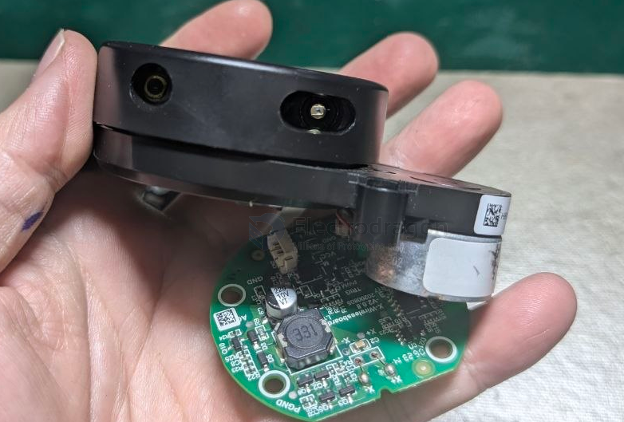

# sensor-lidar-dat

LIDAR (Light Detection and Ranging) sensors use laser light to measure distances to objects. They emit laser pulses and measure the time it takes for the light to reflect back, allowing for precise distance calculations. LIDAR is commonly used in autonomous vehicles, robotics, and mapping applications.

## products 

- EG393

- [[STC-dat]] - 8G1K08

interface == VCC / TXD / -- / GND == [[serial-dat]] == 5V

## demo 

https://t.me/electrodragon3/447

## code 

https://github.com/Edragon/sensor-lidar

## ref 

