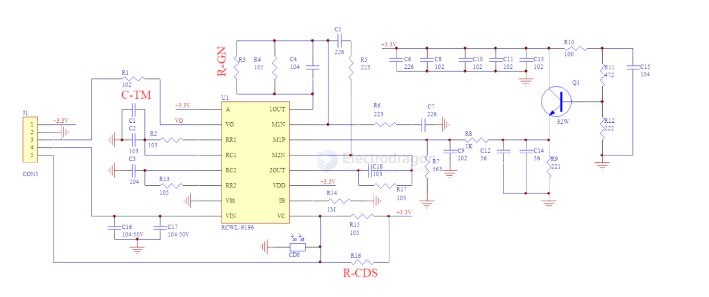
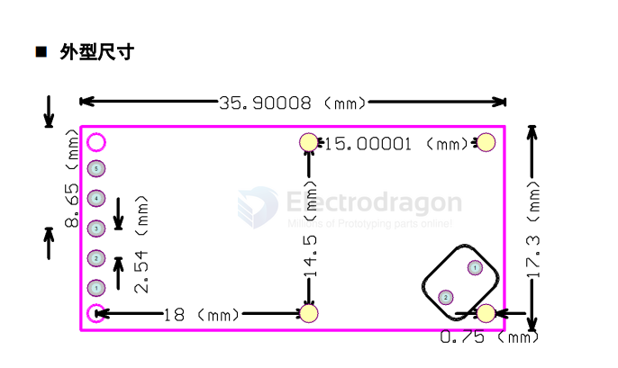

# sensor-RCWL-dat

## SCH 

## dimension 

RCWL-0516 是一款采用多普勒雷达技术，专门检测物体移动的微波感应模块。采用2.7G 微波信号检测，该模块具有灵敏度高，感应距离远，可靠性强，感应角度大，供应电压范围宽等特点。

微波感应是一种新型无死角，基于多普勒雷达原理的感应模式。其平面型天线发出电磁波并接收反射回波，可有效抑制高次谐波和其他杂波的干扰；可靠性强、安全方便。

与红外产品比较：微波开关感应距离更远，角度广，无死区，能穿透玻璃和薄木板，根据功率不同可以穿透不同厚度的墙壁，不受环境、温度、灰尘等影响，在 37 度情况下，感应距离不会缩短。广泛应用于各种人体感应照明和防盗报警等场合。

主要特性
- ⚫ 工作电压：3.3-18V
- ⚫ 工作电流：3mA
- ⚫ 预留直插 CDS 接口
- ⚫ 5-8 米典型感应范围
- ⚫ 感应距离可调
- ⚫ 2.7G 工作频率
- ⚫ 重复触发时间可调
- ⚫ 最小触发时间 2S
◼ 典型应用
- ⚫ 楼道灯，感应灯，太阳能灯
- ⚫ 紫外线杀毒灯
- ⚫ 人体移动感应

## ◼ 应用设计时应注意

1、感应面正前后方不得有任何金属遮挡。
2、感应面的前后方要预留 2 厘米以上的空间。如果应用灵敏度要求很高，建议
预留 4CM 以上距离，模块后面遮挡空间尽可能小。
3、模块与安装载体平面尽可能平行。
4、模块的有元器件面为正感应面，反面为负感应面。负感应面效果略差。
5、微波模块不能在同一区域大规模应用，否则会出现相互干扰，，单个体之间间
距最好大于 2 米以上。

## info 

The RCWL microwave sensor is a motion detection sensor that uses microwave Doppler radar technology. 

It emits microwave signals and detects changes caused by moving objects, such as people or animals. 

The RCWL sensor is commonly used for non-contact motion sensing in lighting, security, and automation systems. 

It can detect motion through certain materials (like plastic or glass) and works in various lighting conditions.

## Advantages of RCWL Sensors Compared to PIR Sensors

### 1. Detects Through Objects
- **RCWL Advantage**: Uses microwave Doppler radar technology, allowing it to detect motion through non-metallic materials like glass, wood, or plastic. Ideal for hidden or enclosed setups.
- **PIR Limitation**: Relies on detecting infrared radiation (heat) and requires a direct line of sight. Cannot "see" through objects.

---

### 2. Greater Sensitivity and Range
- **RCWL Advantage**: Longer detection range (up to 7–10 meters or more) and higher sensitivity to small movements.
- **PIR Limitation**: Limited range of about 3–5 meters and less effective at detecting subtle motion.

---

### 3. Less Affected by Small Animals
- **RCWL Advantage**: Less likely to flag small animals (e.g., birds, flies, spiders) as it detects motion based on Doppler shift rather than heat.
- **PIR Limitation**: Prone to false positives from heat signatures of small animals or insects.

---

### 4. Wider Field of Detection
- **RCWL Advantage**: Can provide 360-degree motion detection if unobstructed, making it more versatile for wide-area monitoring.
- **PIR Limitation**: Typically has a narrower field of view (about 120 degrees) and requires proper alignment.

---

### 5. Faster Response Time
- **RCWL Advantage**: Detects motion almost instantly using electromagnetic waves.
- **PIR Limitation**: May have a slight delay as it relies on detecting changes in infrared radiation.

---

### 6. Compact and Cost-Effective
- **RCWL Advantage**: Small, inexpensive, and simple to use with microcontrollers like ESP32 or Arduino. Requires fewer external components (e.g., no Fresnel lens).
- **PIR Limitation**: Bulkier due to the Fresnel lens and may cost more depending on the model.

---

### Use Cases for RCWL Sensors
- **Hidden or Enclosed Motion Detection**: Detecting motion through walls, ceilings, or casings.
- **Small and Efficient Devices**: Consumes ~2.5 mA, making it energy-efficient.
- **Applications in Noisy or Dynamic Environments**: Less affected by environmental noise like sunlight or temperature changes.

---

### Limitations of RCWL Compared to PIR
1. **Susceptible to Interference**: May detect unintended motion from fans, machinery, or large metallic objects.
2. **Higher False Positives in Open Areas**: Microwave signals can reflect off surfaces and detect motion in adjacent rooms.
3. **More Power Consumption**: While still efficient (~2.5 mA), it consumes more power than some PIR sensors (~50 µA).

---

### Summary
- **RCWL Sensors**: Better for hidden, long-range, and sensitive motion detection.
- **PIR Sensors**: Better for simple, line-of-sight applications where heat-based detection suffices.
