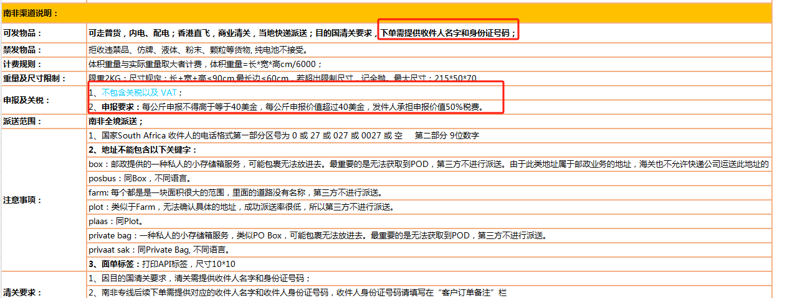

# EURPOST-za.md

## EN Note 

### South Africa Declaraction

- 不包关税以及 VAT
- 下单需提供收件人名孛和身份证号码
- 每公斤申报不得高于等于40美金。每公斤申报价值超过40美金, 发件人承申报价值50% 税费。

- Excludes tariffs and VAT
- When placing an order, you need to provide the recipient’s name and ID number.
- The declaration fee shall not be higher than or equal to US$40 per kilogram. If the declared value per kilogram exceeds US$40, the sender shall bear 50% tax on the declared value.

- [[ZAEXPRESS]]

The declared value per kilogram shall not be higher than or equal to US$40. If the declared value per kilogram exceeds US$40, the sender shall bear 50% of the tax on the declared value.
For example: the declared value of 0.2KG cannot be higher than or equal to US$8; any product price tags or invoices of any form are prohibited in the express, otherwise taxes will be paid additionally;

Example 
- 1KG = 40U
- 0.5KG = 20U

