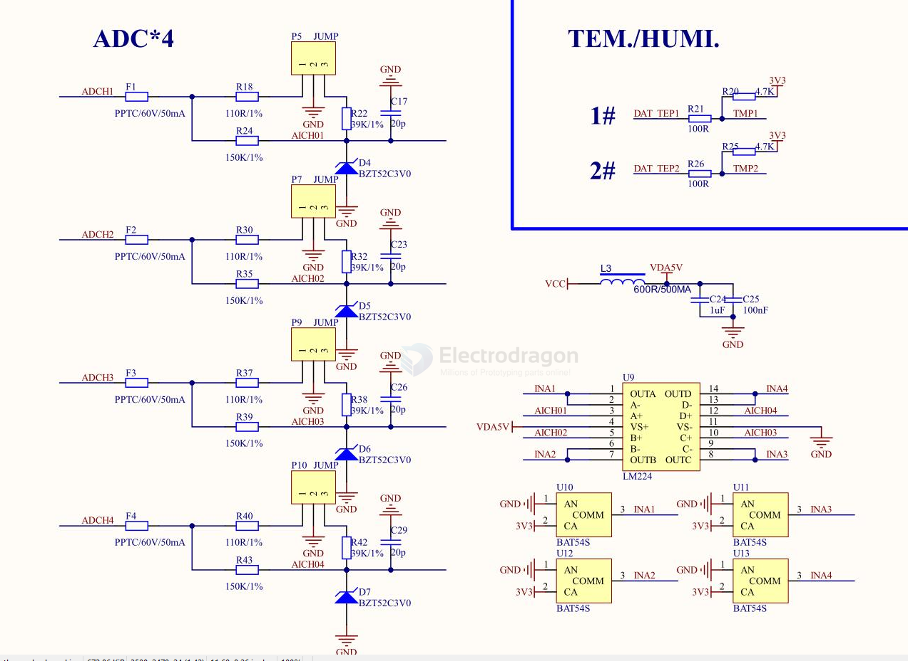

# ADC-dat

- [[ADC-bat-monitor-dat]] - [[voltage-divider-dat]]

## chips 

- [[ADS1100-dat]]
- AD7606
- AD7799
- AD7880 == LC2 MOS Single +5 V Supply, Low Power, 12-Bit Sampling ADC

## SCH 

### ADC with measure MOSFET control 

- [[transistor-dat]] - [[mosfet-dat]]

- [[voltage-divider-dat]] 

- [[ESP32-ADC-dat]]

1. **ADC Ctrl LOW (0V):**
    - Q8 is **OFF** (no base current).
    - The gate of Q7 is pulled up to VBAT via R30.
    - Q7 (P-MOSFET) is **OFF** (Vgs ≈ 0V).
    - No voltage is present at BAT_ADC; the voltage divider is disconnected from VBAT.
    - **ADC input is isolated** (saves power, prevents leakage).

2. **ADC Ctrl HIGH (e.g., 3.3V or 5V):**
    - Q8 is **ON** (base current flows via R9/R25).
    - Q8 pulls the gate of Q7 **towards GND** through R31.
    - Vgs of Q7 becomes negative (gate lower than source), **turning Q7 ON**.
    - VBAT is now connected to the voltage divider (R32/R33).
    - The divided voltage appears at **BAT_ADC** for ADC measurement.

### Purpose

- **Power Saving:** Only connects the voltage divider to the battery when ADC measurement is needed, reducing continuous current drain.
- **Control:** Allows the microcontroller to enable/disable battery voltage sensing.

### Summary Table

| ADC Ctrl | Q8 (NPN) | Q7 (P-MOSFET) | BAT_ADC Output      |
|----------|----------|---------------|---------------------|
| LOW      | OFF      | OFF           | Disconnected (0V)   |
| HIGH     | ON       | ON            | Battery voltage via divider |

---
**In summary:**  
`ADC Ctrl` enables or disables the battery voltage divider connection to the ADC

### 2x mosfet 2x ADC measurement 

### 4x ADC reader 

- [[LM224-dat]] - [[TI-signal-dat]]

- [[BAT54S-dat]]

## other 

- [ADS7046 12-Bit, 3-MSPS, Single-Ended Input, Small-Size, Low-Power SAR ADC](https://www.ti.com/lit/ds/symlink/ads7046.pdf?ts=1758413865175)

- ADS1015

- AD9854ASTZ == CMOS 300 MSPS Quadrature Complete DDS == Data Acquisition ADCs/DACs - Specialized 200 MHZ QUADRATURE DDS SYNTHESIZER PBFre == 

- AD8561ARZ

- AD7864 == 4-Channel, Simultaneous Sampling, High Speed, 12-Bit ADC

## ref 

- [[tech-dat]]
